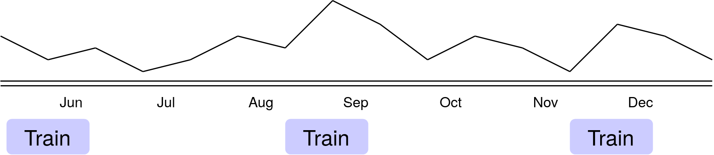

# Looking Ahead to 2028

 

<v-clicks>

- Anonymous payments
- More fine-grained data
- Redesigning the inference pipeline
- Scaling the training pipeline

</v-clicks>

<SlideCurrentNo class="absolute bottom-8 right-10"/>

<!--
To wrap up this first part of the talk, let's look into the future a bit.

We want to run this project again. 2026 is a little bit too close to make any meaningful changes, so we're setting our sights on the 2028 elections.

There are three major changes that we're exploring as we build the next version.

First, we want to collect more data, while respecting user privacy.

Second, we want to redesign and rebuild the inference pipeline to take advantage of the fact that inference is an easier problem than training.

Third, we want to scale up the training pipeline to be able to accommodate more users and a larger sample.

And finally, we want to make the payment process anonymous.

I'll talk about our plans for these first three points. I won't say any more about payment since we already talked about payment a lot. 
-->