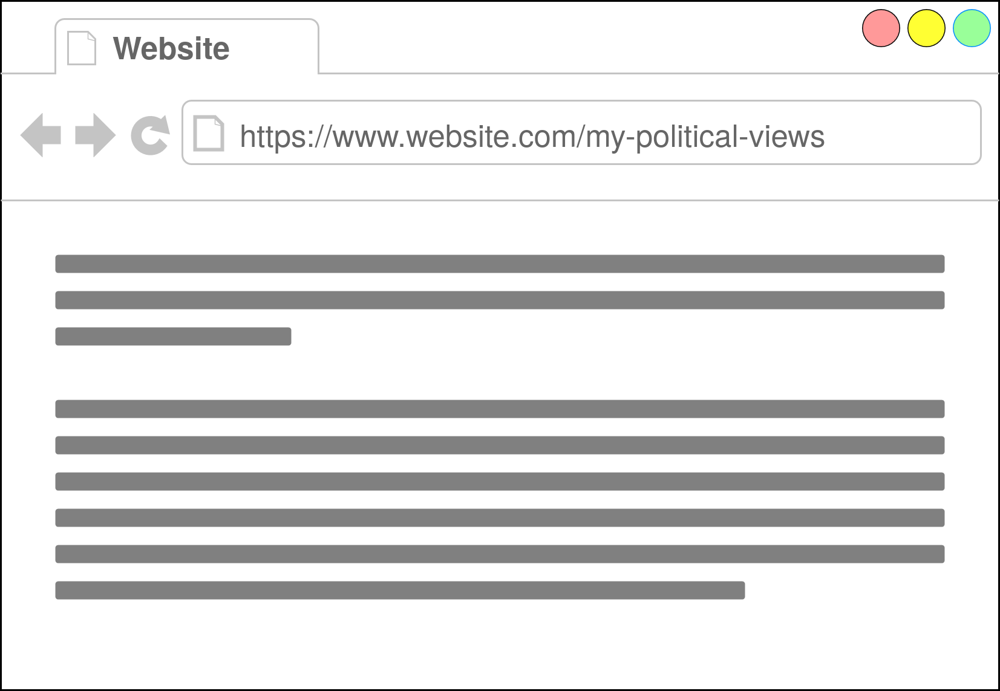
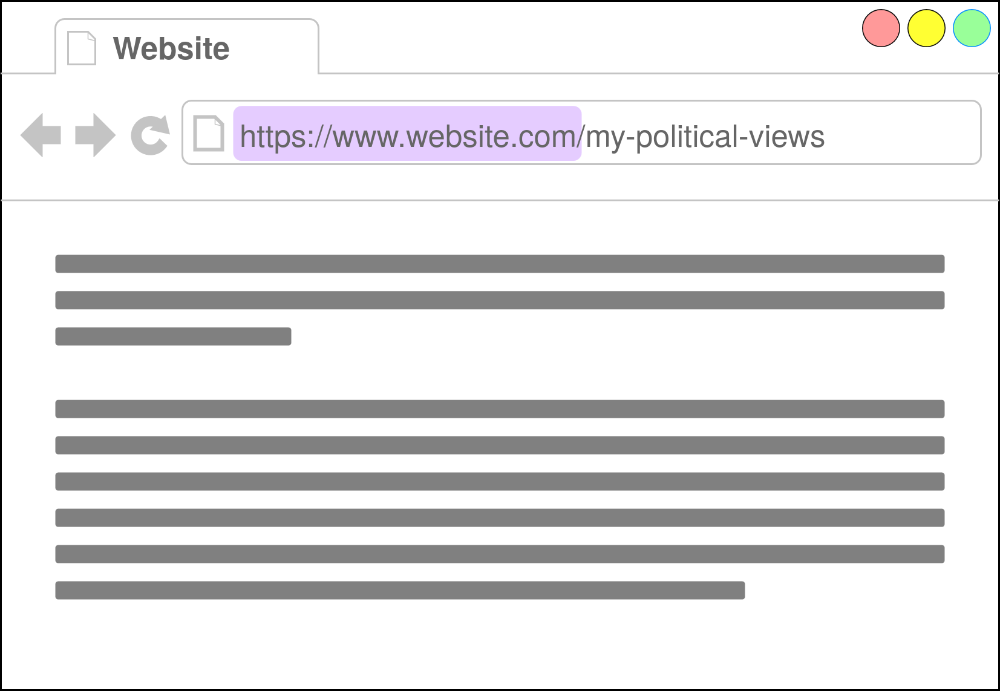
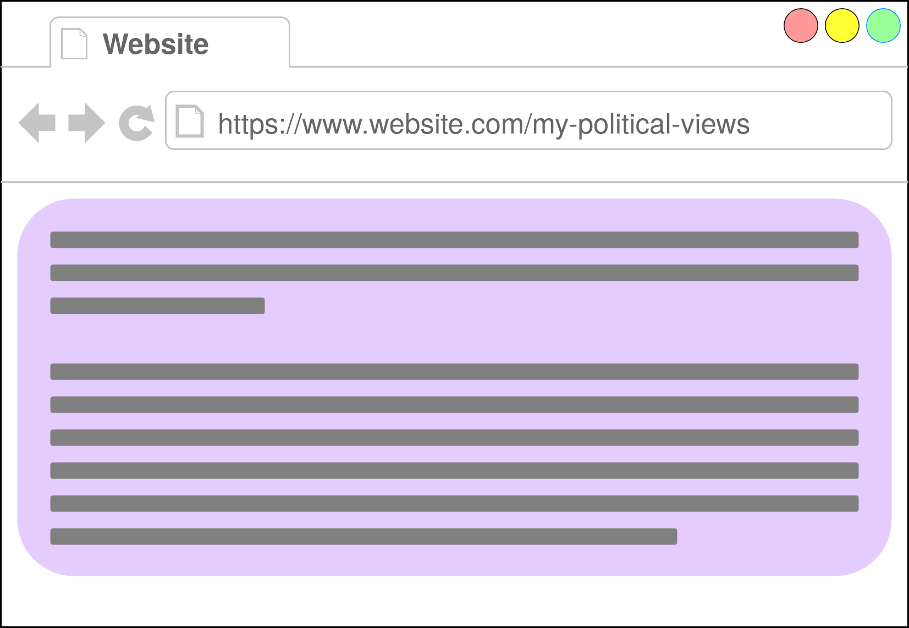

# More Fine-Grained Data

 

<ul>
    <li v-click="1">Beyond domains</li>
    <li v-click="5">LLM in browser to generate embeddings</li>
</ul>

  

  
  
  = 4">

<SlideCurrentNo class="absolute bottom-8 right-10"/>

<!--
In any machine learning system, the data is critical. One of the main directions we're exploring is how to collect more, of course while still preserving user privacy. I'll walk through what we're currently thinking about and working on.

So far, we've only been collecting the domains visited. So if we have a website like this, we're only looking at website.com, even if the rest of the page has more information about political beliefs.

So, what can we do? We want to be able to take advantage of all the information available to us, which means looking at the body of the webpage.

We want to get a consistent output from each website visit, so what we want to do is run the content of the webpage through a language model to generate an embedding. Then the embeddings can replace our visit histograms as the main source of information. We want to run the LLM on the client side in the browser, so we'll be using a very very lightweight model.
-->