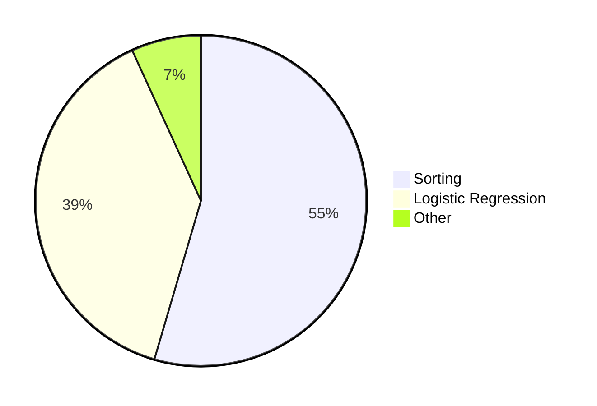

# Scaling Up Training

- 2k $\to$ 10k clients
-
- Bottleneck: oblivious sorting

<SlideCurrentNo class="absolute bottom-8 right-10"/>

<!--
The more difficult half of this project is training the models, because training creates dependencies between clients, so we can no longer treat clients independently.

Regardless of which cryptographic techniques we use for training, we're going to have to scale up oblivious sorting.

And I want to use that point to segue into the second half of this talk, which is about oblivious sorting and ORQ.
-->