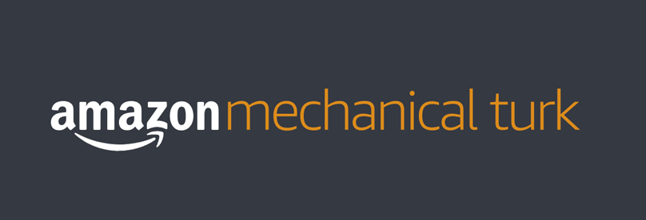

# Payment

 

<v-clicks depth="2">

- Users are paid and recruited through Mechanical Turk
    - Requires knowledge of non-anonymous MTurk ID
    - Which users on which days

</v-clicks>

 

<v-clicks depth="2">

- BU IRB process took too long
    - BU was not allowed to hold personally identifiable information

</v-clicks>

<callout y="70" v-click="6">
    Communication by email
</callout>

<SlideCurrentNo class="absolute bottom-8 right-10"/>

<!--
Now I want to transition a little bit and talk about payment. Paying our users was unexpectedly one of the most interesting parts of this project. We didn't really realize it until we started writing the paper, but we wound up doing something that amounted to a weird form of secure computation.

To start with the basics, we paid our users for their participation, that's how we managed to get thousands of users. And we recruited them and paid them through Amazon Mechanical Turk, which is a service for finding gig workers.

The important points are that in order to pay users, we need to know their MTurk ID, which is not anonymous, and we need to know which users were active on which days.

This seems like it should be pretty straightforward, but there was a little wrinkle. The BU IRB process was taking too long, so we didn't end up getting approval in time for the deployment. The only IRB approval was for WashU, which meant that we at BU were not allowed to hold any personally identifiable information, like user IDs.

To make things a little bit more interesting, all communication took place by email.
-->