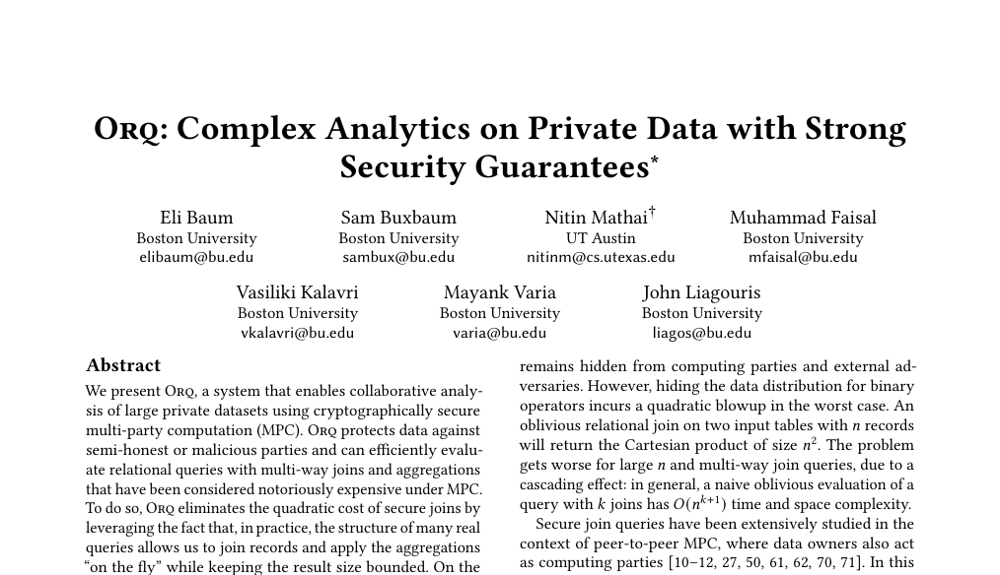

# **ORQ:** Complex Analytics on Private Data with Strong Security Guarantees

 

- Recently appeared at SOSP 25
- System for relational analytics under MPC

  

    
    
    
  

  

 
 
(QR codes for paper and github)

<SlideCurrentNo class="absolute bottom-8 right-10"/>

<!--
Outline
- problem - joins require quadratic space in the intermediate results
- technique - join aggregation operator, solves one-to-many or many-to-many with decomposable aggregations
- why the operator uses oblivious sorting
- final results
-->