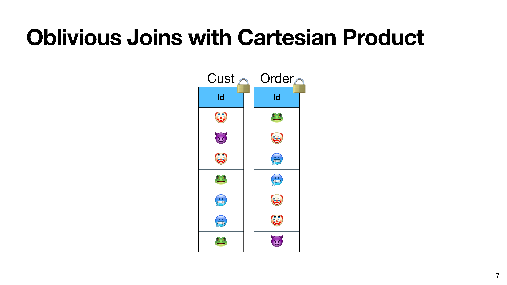
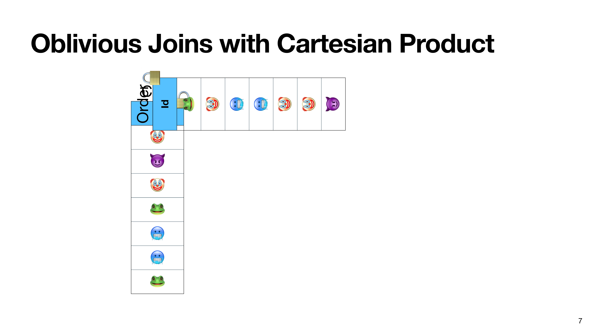
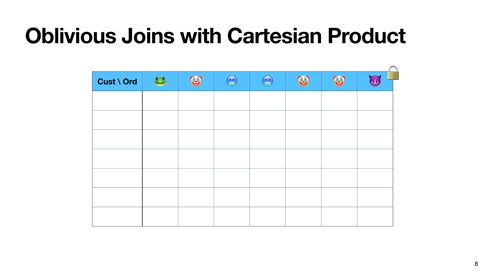
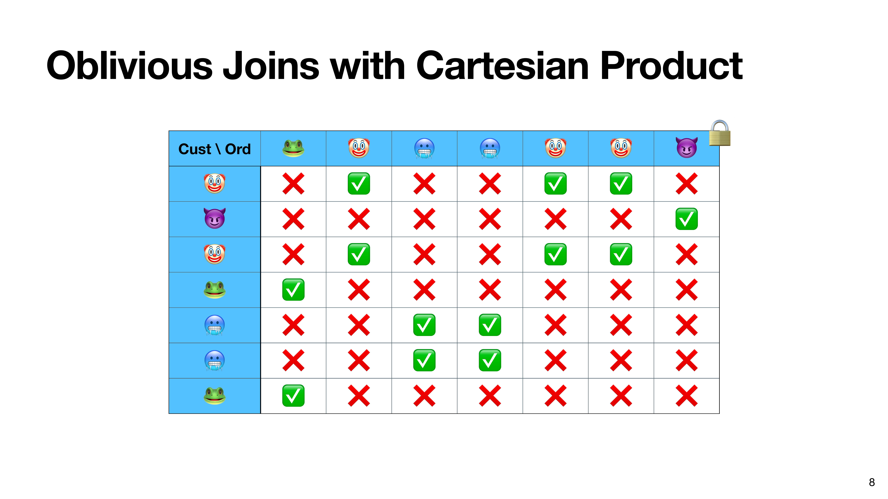

# Oblivious Joins

  

  
  
  
  
  = 3">

<callout x="50" y="87" v-click="4">

  $O(n^2)$ time and space

</callout>

<SlideCurrentNo class="absolute bottom-8 right-10"/>

<!--
The constraint of obliviousness is a lot more problematic for oblivious joins.

A join is a way of combining two tables according to their keys.

What we're interested in is the class of joins known as many-to-many joins, meaning that there can be duplicate keys in both input tables.

The problem is that if we don't know anything about the keys, then in the worst case, we have to materialize the cartesian product of the two tables, which requires quadratic time and space.
-->