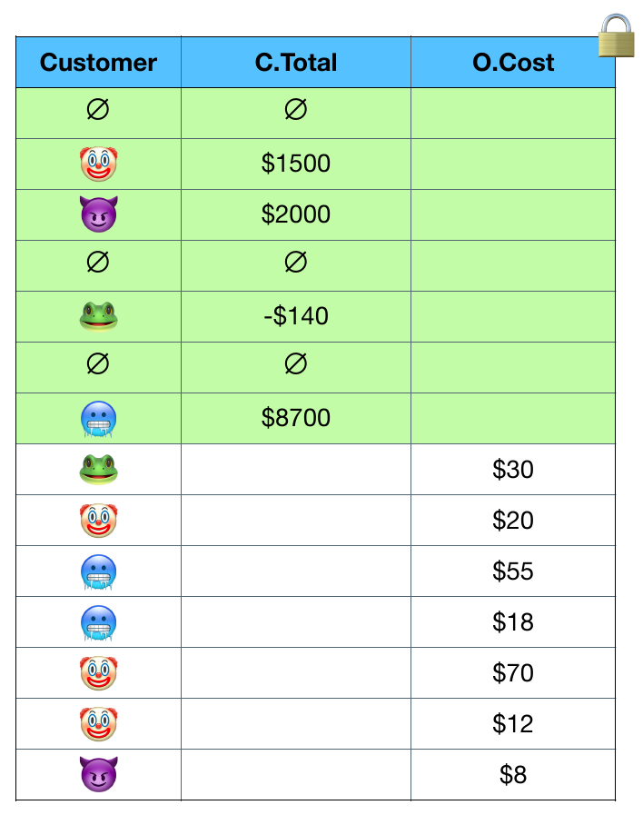

# Supporting Many-to-Many Joins

 

<v-clicks>

We can transform a many-to-many join into a one-to-many join.

*Pre-aggregate* one of the tables and mark duplicate keys as invalid.

</v-clicks>

<v-clicks>

- The aggregation must be decomposable
- All keys must exist in one of the tables

</v-clicks>

<v-clicks>

These constraints hold for all 31 queries from prior work.

</v-clicks>

<SlideCurrentNo class="absolute bottom-8 right-10"/>

<!--
The main algorithmic novelty of this work is the ability to transform a many to many join into a one to many join.

The idea is that we can run the aggregation on the first table ahead of time, a so-called pre-aggregation, and then we can obliviously mark duplicate keys as invalid.

When we concatenate the tables, we'll see something like this. We still have one table before the other, but now the first table has some rows marked as invalid. When we sort, these invalid rows get dropped all the way to the bottom, so they don't affect the results at all. We can't remove the invalid rows without leaking information about the table, but we can ensure that they don't contribute to the output in any way.

Remember that the general case of oblivious joins is still impractically difficult. Our algorithm works when the following two conditions are met.

First, the aggregation must be decomposable, and I'll come to what this means in a moment.

And second, all keys must exist in one of the tables.

We observe that these constraints are met in all practical queries from prior work.
-->