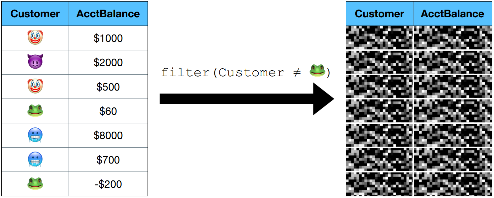

# Oblivious Analytics

<v-clicks>

Secure computation must be *oblivious*.

Oblivious computation must maintain *worst-case* output sizes.

</v-clicks>

 

    
    

<SlideCurrentNo class="absolute bottom-8 right-10"/>

<!--
Let's start with the fundamental problem that has been plaguing secure databases for quite some time.

Any secure computation must be oblivious, meaning the control flow must be independent of the data.

This means that oblivious computation must maintain worst-case output sizes.

Here's an example. On the left we have a table with a key column and a data column. Suppose we want to filter out all the data where the key is frog.

In plaintext, this would reduce the size of the table. But in an oblivious database, we can't change the size of the table without leaking to the adversary how many elements had the frog key.

In this case of a filter, this constraint isn't too problematic. It means we can't shrink the table at all, but it's not like it's increasing the size of the table. This is just the standard cost of doing oblivious computation.
-->