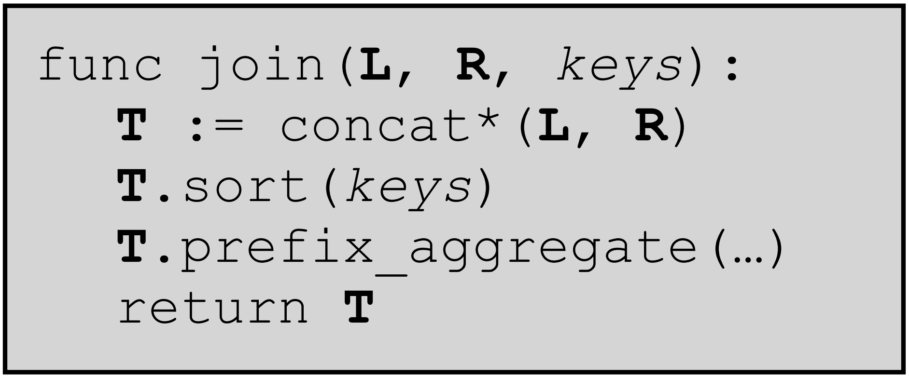

# Join-Aggregation Operator

 

<v-clicks>

Starting point: one-to-many joins

</v-clicks>

 

<v-clicks>

    

</v-clicks>

 
 

<v-clicks>

    <h3>Reduces to sorting and aggregation!</h3>

</v-clicks>

<SlideCurrentNo class="absolute bottom-8 right-10"/>

<!--
As our core algorithm, we propose a hybrid join-aggregation operator that combines the join and aggregation.

As a starting point, let's consider the case of a one to many join. This means that one table has unique keys, and the other table has duplicate keys.

The operator takes as input a left table and a right table, as well as a list of keys to join on.

We concatenate the left and right tables, then we sort them according to the key columns, and then we run an aggregation circuit on the sorted result.

Maybe you can already tell, but the reason I talked so much about oblivious sorting before this... is that this entirely reduces to sorting and aggregation.
-->