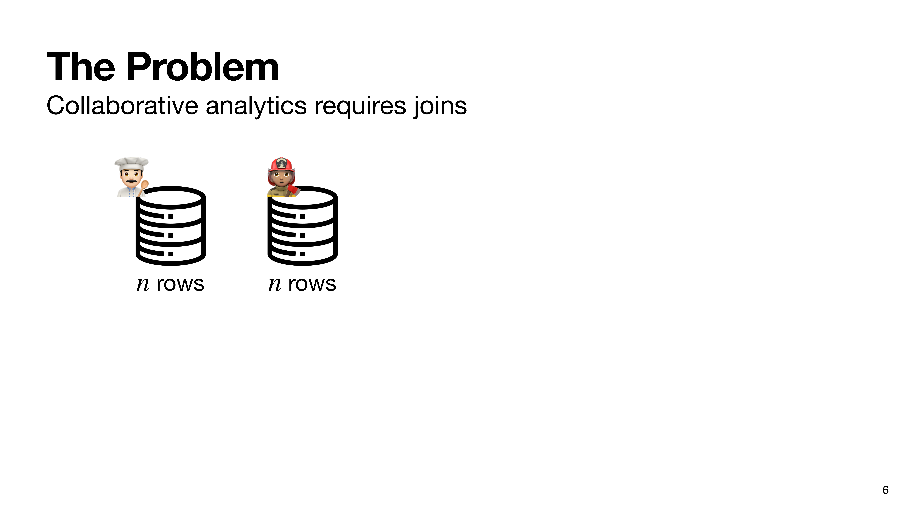
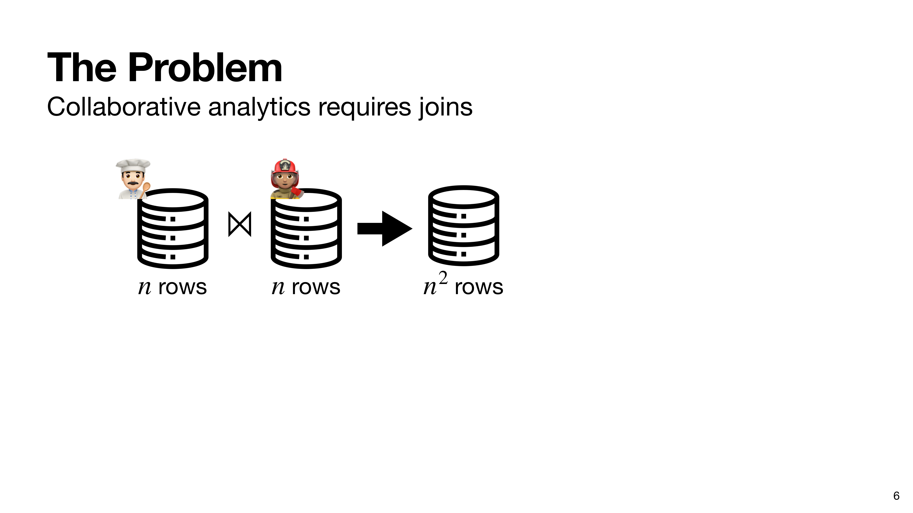
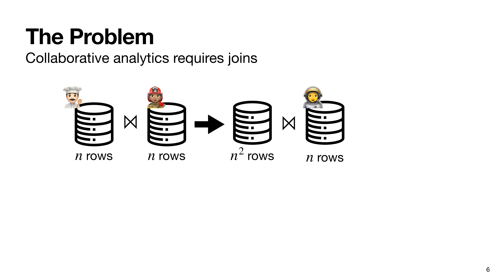
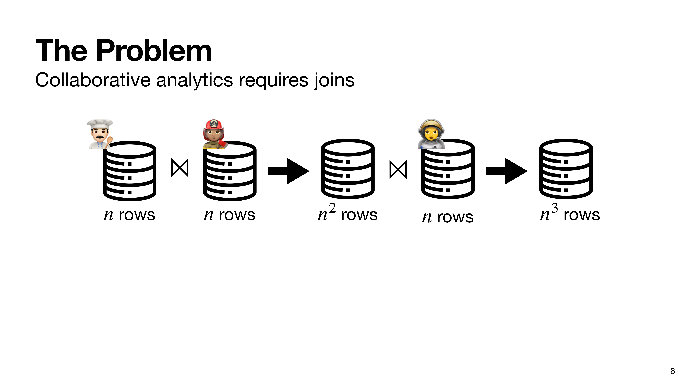
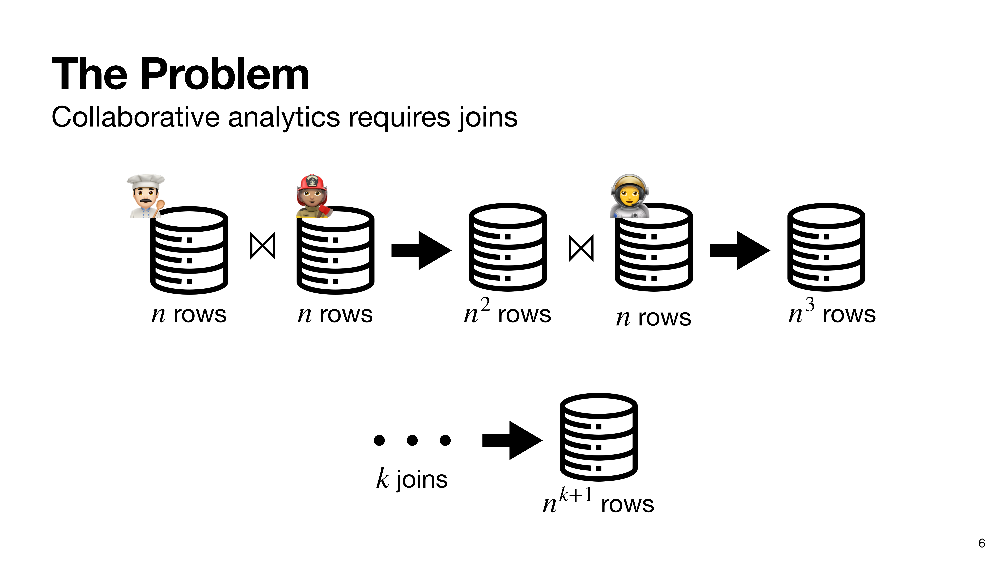

# The Problem

  

  
  
  
  
  
  
  

<SlideCurrentNo class="absolute bottom-8 right-10"/>

<!--
So, to sum up, the problem is the following. We have two input tables, where we don't know of any constraints on the keys of either table.

Joining them leaves us with a table of quadratic size. Then, if we try to join another table with the first result, then we get a table of cubic size.

This is a cascading effect, so for real world queries of interest which require a lot of joins, we're left with an output of size n to the k plus 1 for k joins.

This is obliviously not practical, and prior work has used this barrier to argue that we need leakage in order to evaluate complex queries.

We're going to take a different approach.
-->