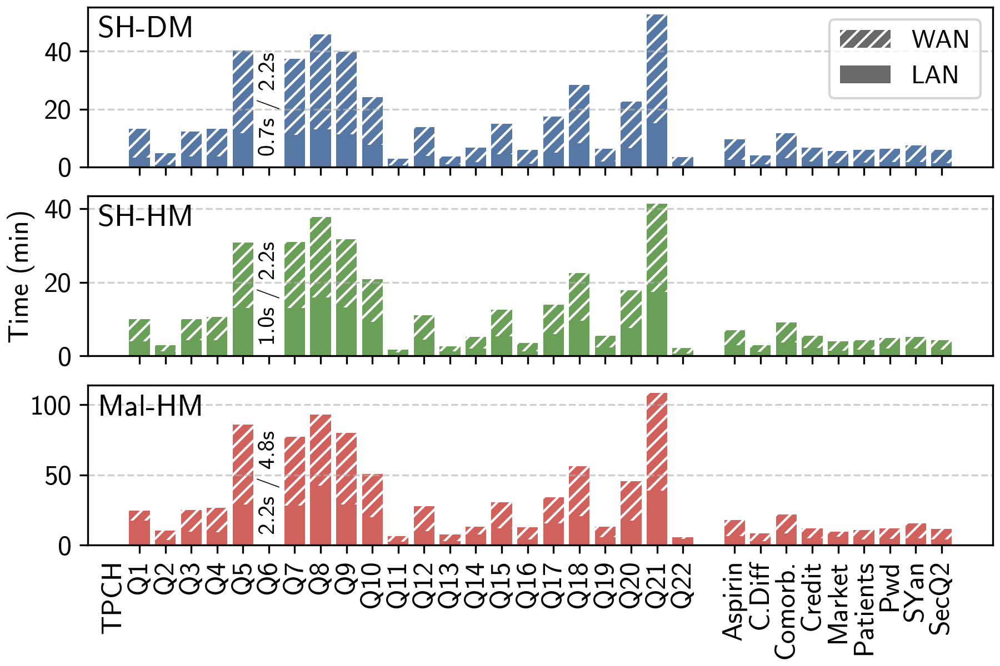

# Query Benchmarks

 

    

<callout x="71" y="72" v-click="1">
    Prior work
</callout>

<SlideCurrentNo class="absolute bottom-8 right-10"/>

<!--
The goal of this work was to make secure analytics practical, so it's time to show some results.

Here we have a benchmark of 31 queries, where input sizes are databases with a size of 1 gigabyte.

The 9 queries on the right are all queries found in prior work in the MPC literature. Importantly, some of these queries were believed to be inherently difficult under MPC and were used to motivate the need for leakage. As you can see, we evaluate all of these queries in just a few minutes for a 1 gigabyte databatse.

On the left, we have the entire TPC-H benchmark. This is a standard benchmark for plaintext database systems and is meant to capture an array of practical queries to stress test the system. We are the first to securely evaluate all queries from the benchmark, and we do so in under an hour in LAN for all queries.
-->