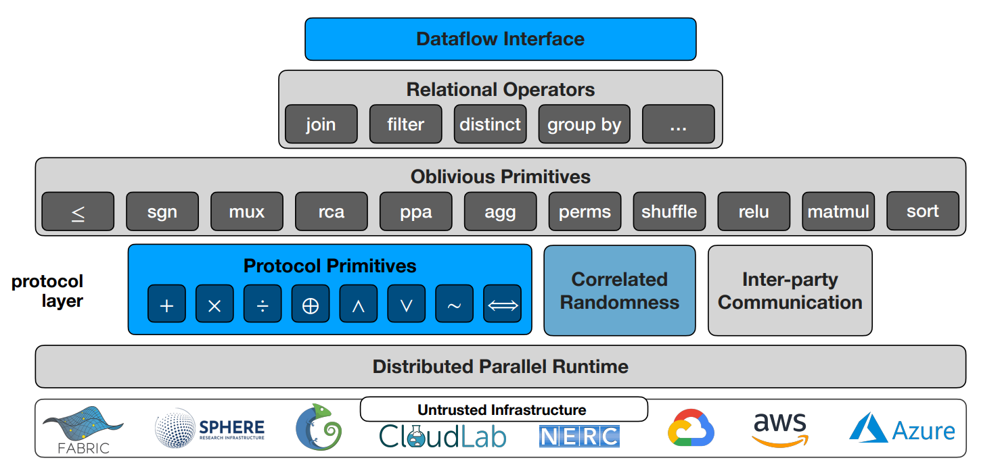

# The ORQ System

 

<v-clicks depth="2">

- Familiar API
- Protocol-agnostic interface
    - Support for 2PC, 3PC, 4PC
- Data-parallel runtime
- Custom TCP Communicator

</v-clicks>

<SlideCurrentNo class="absolute bottom-8 right-10"/>

<!--
So far I've skipped over most of the systems work that went into all of this, but ultimately we spent a lot of effort building the system so that people could actually use it, so I'll take my last couple minutes to talk about the system itself.
-->