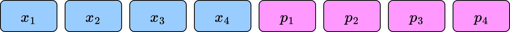

# Extracting Sorting Permutations

 

<v-clicks>

Two Challenges

</v-clicks>

<v-clicks>

- Ensuring stability
- Extracting the applied permutation

</v-clicks>

 

<v-clicks>

One Solution

</v-clicks>

<ul>
    <li v-click="5">Input padding</li>
    <li v-click="8">Padded bits represent the applied permutation</li>
</ul>

<callout x="67.8" y="67" v-click="7">

$x_i \to x_i || i$

</callout>

<SlideCurrentNo class="absolute bottom-8 right-10"/>

<!--
We have a ton of small tricks related to sorting scattered throughout the paper, but I want to mention one in particular. That's the extraction of a sorting permutation.

When we do a sort, there are two challenges we want to solve, and we can actually solve them both with the same mechanism.

First, we want the sorting algorithms to be stable. The radix sort algorithm I showed is stable, but the quicksort algorithm is not, so we need to do some extra work to guarantee stability.

Second, we want to know what permutation was applied, so we can apply that same permutation to other columns or vectors. The permutation that we get as output should be secret-shared.

We only need one mechanism to solve both of these simultaneously, and that mechanism is input padding. Before invoking the sorting protocol, we attach additional bits encoding each element's initial position, so we attach secret sharings of the numbers 1 through n. Note that this is before the shuffle in quicksort.

Then we run the sorting protocol as a black box. In the end, we can break off the padding bits, and they represent the permutation that has been applied, so now we have a secret sharing of the sorting permutation.
-->