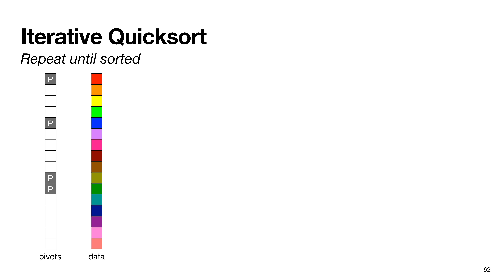
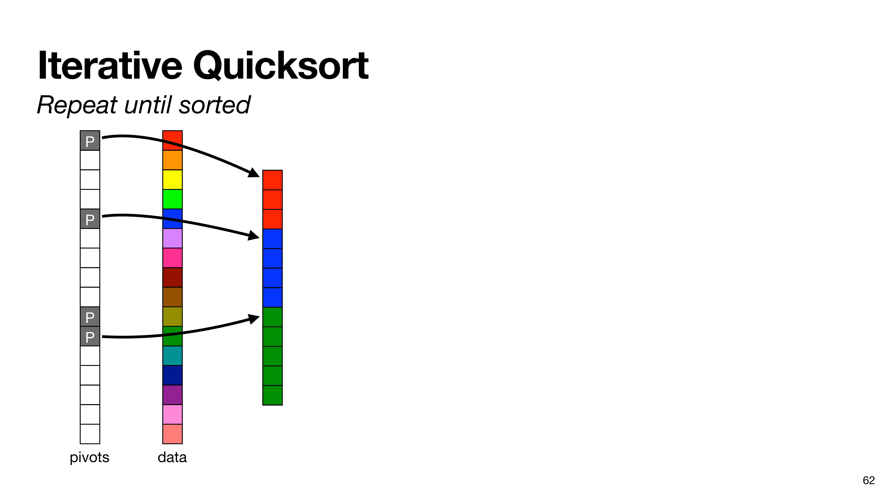
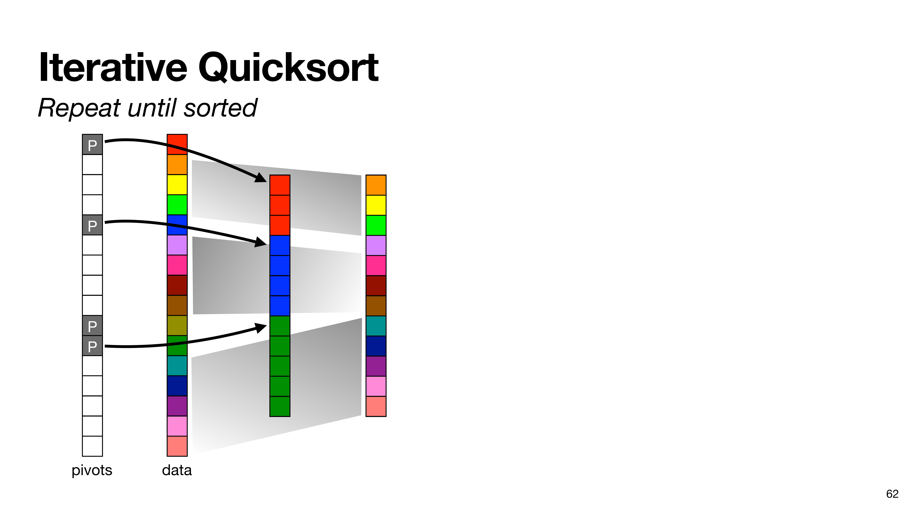
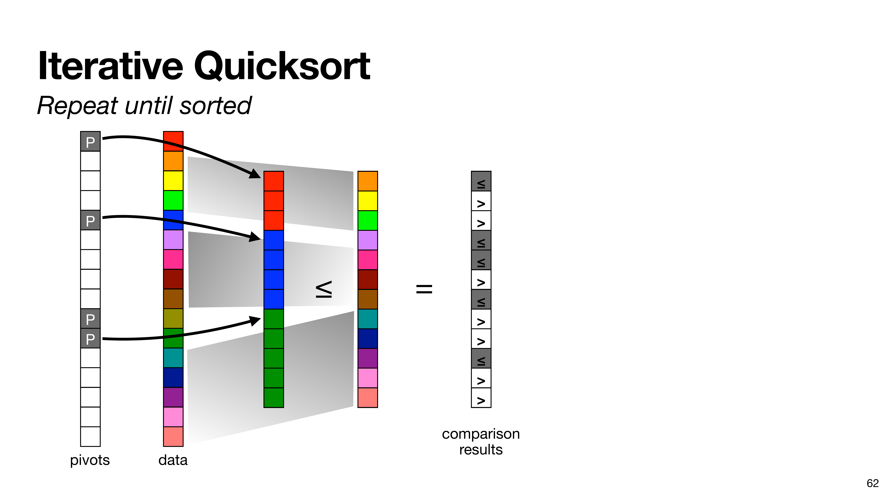
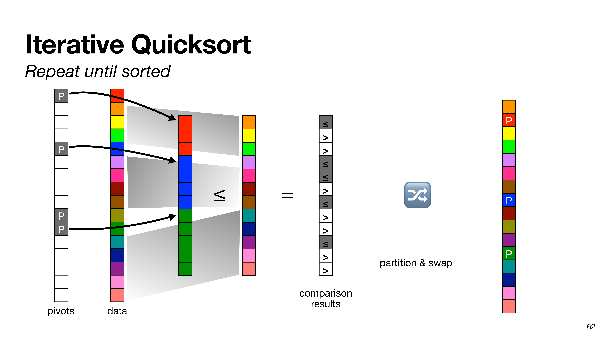
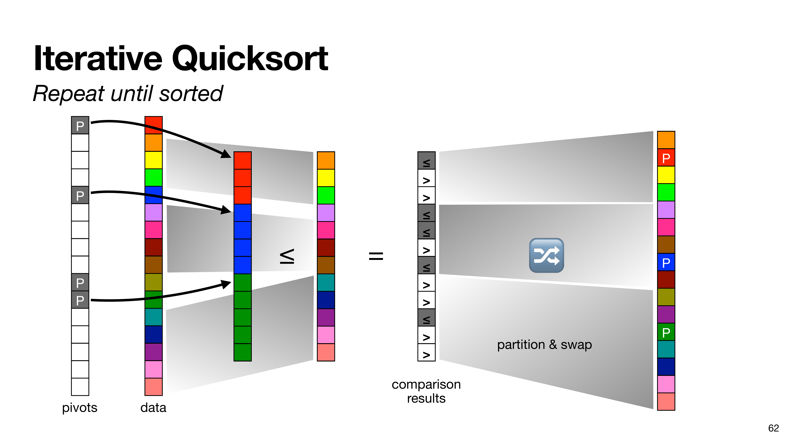
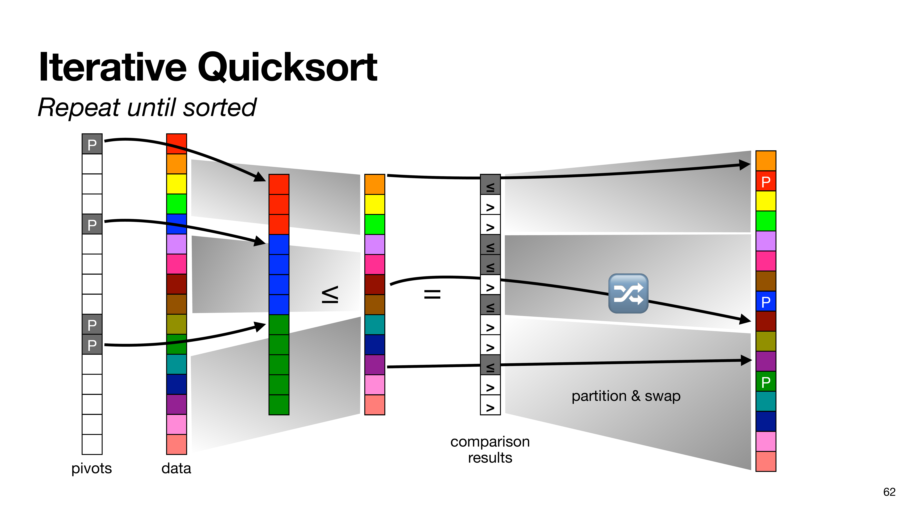

# Iterative Quicksort

  

  
  
  
  
  
  
  
  
  
  
  

<SlideCurrentNo class="absolute bottom-8 right-10"/>

<!--
Here's a visualization of our quicksort algorithm.

You're probably familiar with a recursive form of quicksort, but that recursive version is rather difficult to implement in parallel in MPC, so here we show how to use an iterative control flow.

At the beginning of an iteration, we have our data vector on the right, split into some number of smaller pieces by earlier iterations. Here we have 4 blocks. At the beginning of each block, we have the element that's going to act as the pivot for that block in this iteration. We have a separate indicator vector for the pivot indices.

We want to compare all the non-pivot elements with the pivot before them, so we construct two vectors to compare. In this first vector, we copy the pivot element once for every element to compare with it. In this second vector, we copy over all the non-pivot elements.

Then we do the comparison. We *open* the comparison results, so this result vector is known in plaintext to all parties.

This means that the final step of reordering the elements is a local operation.
-->