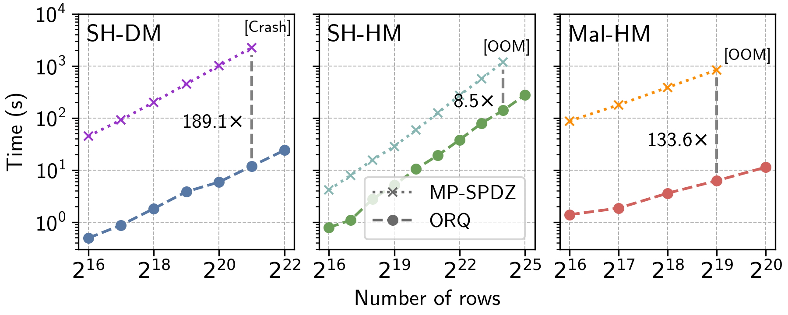

# Comparison with MP-SPDZ

 
 

    

    
<b>SH-DM: </b><em>ABY (2PC)</em>

    
<b>SH-HM: </b><em>Araki et al. (3PC)</em>

    
<b>Mal-HM: </b><em>Fantastic Four (4PC)</em>

<SlideCurrentNo class="absolute bottom-8 right-10"/>

<!--
The numbers on the last slide are great, but in case you don't believe me yet, here we compare them to MP-SPDZ. If you're not familiar with it, MP-SPDZ is a framework for MPC with just an incredible generality, but in terms of performance, we can beat it by quite a lot.

As you can see, our sorting implementations get between an 8x and almost 200x improvement over MP-SPDZ. In the three-party case, Marcel has done a lot of optimizations to make the protocol asymptotically efficient with a good oblivious shuffle protocol. In this setting, we implement basically an identical protocol to MP-SPDZ, but we do so with support for parallelism and some other systems optimizations, which gives us an 8x improvement.

Our main contribution is that we extend this same efficiency which previously only really applied in the three-party case to the two party and four party cases. And that's where we get the 100 to 200x speedups.

Also, note the scale here. We're only scaling up to a few million elements in the two and four party cases, because this is when MP-SPDZ can't go any further, even though we can go up to half a billion like in the previous slide.
-->