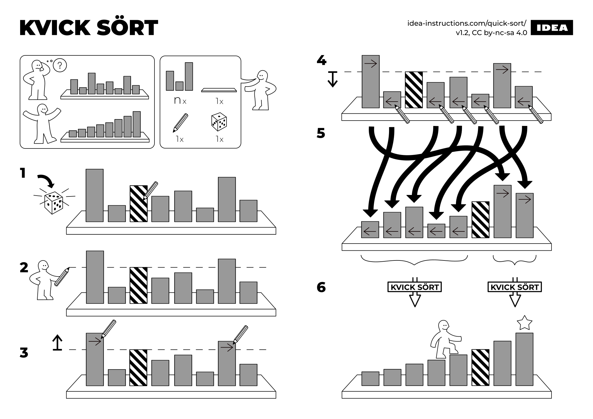

# Oblivious Quicksort

 

<v-clicks depth="2">

- Control flow is non-oblivious
- Shuffle-then-sort paradigm
    - Reveals sorted order of shuffled elements
    - Uncorrelated with original order

</v-clicks>

  

<SlideCurrentNo class="absolute bottom-8 right-10"/>

<!--
Now it's time to get into the details.

A cartoonish version of the plaintext algorithm is shown on the right.

You may be wondering how we can do quicksort obliviously, because the control flow is data-dependent or non-oblivious.

To do this, we employ the shuffle-then-sort paradigm. The idea here is that we can obliviously shuffle the input list such that no party knows which permutation has been applied.

This means that we're free to do a non-oblivious algorithm, which reveals the sorting permutation being applied, but the sorting permutation is now uncorrelated with the original input order.

A way of thinking about this is that we're applying two permutations, and since no party knows the shuffling permutation, it acts like a one-time pad on the sorting permutation.
-->