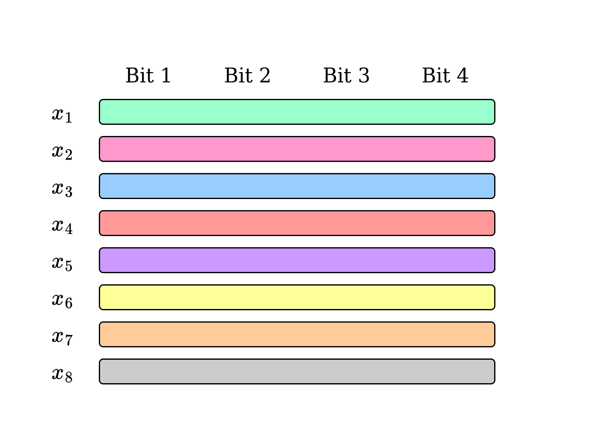
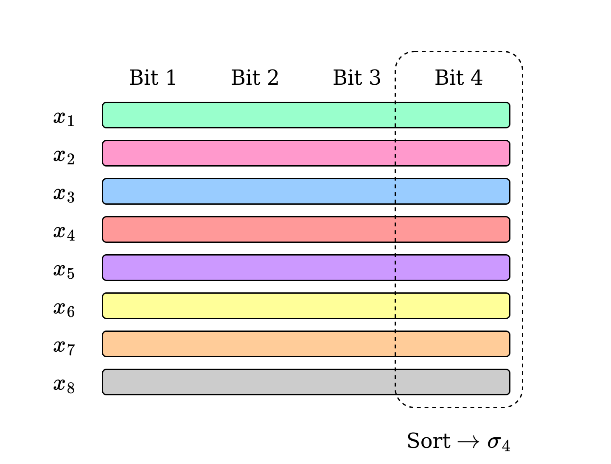
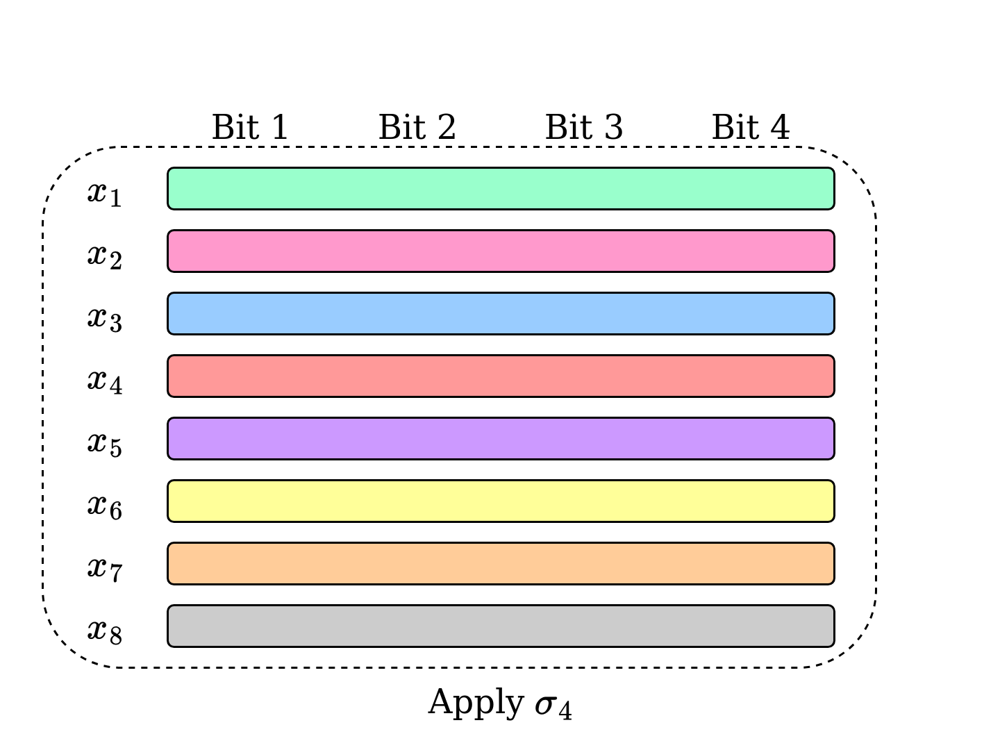
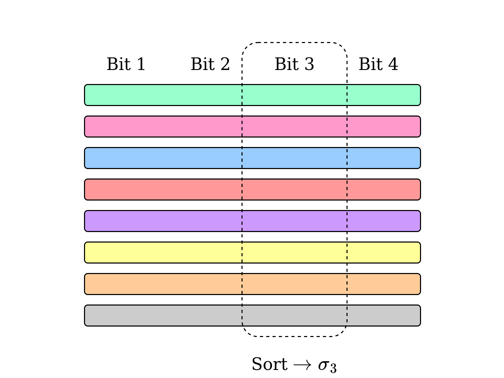
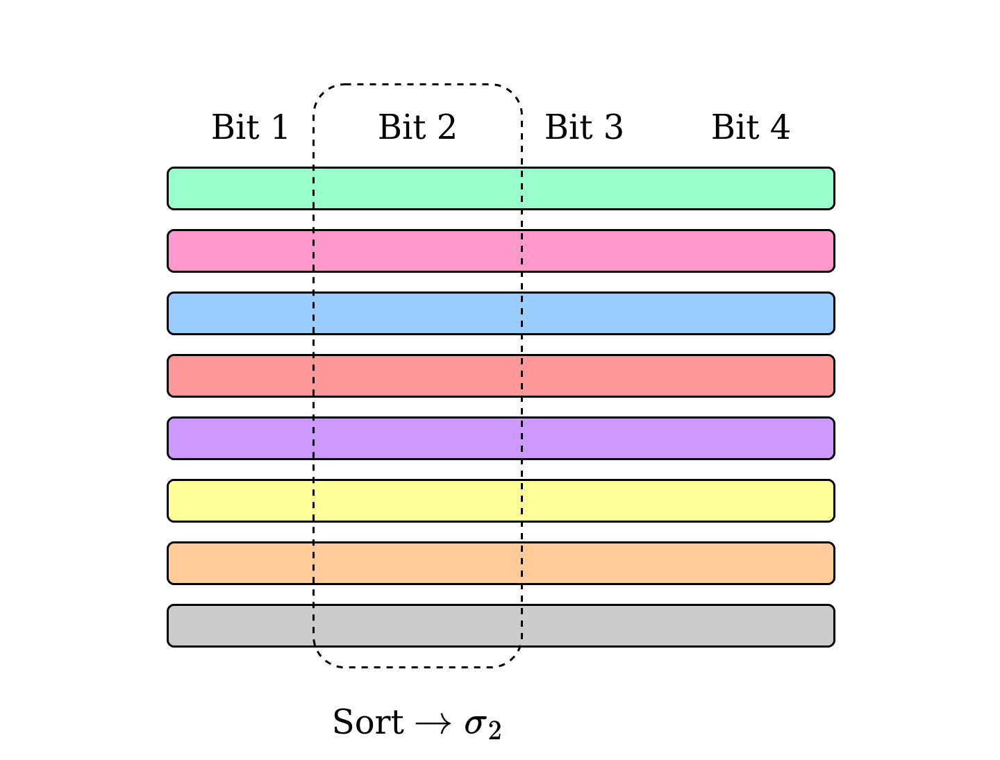
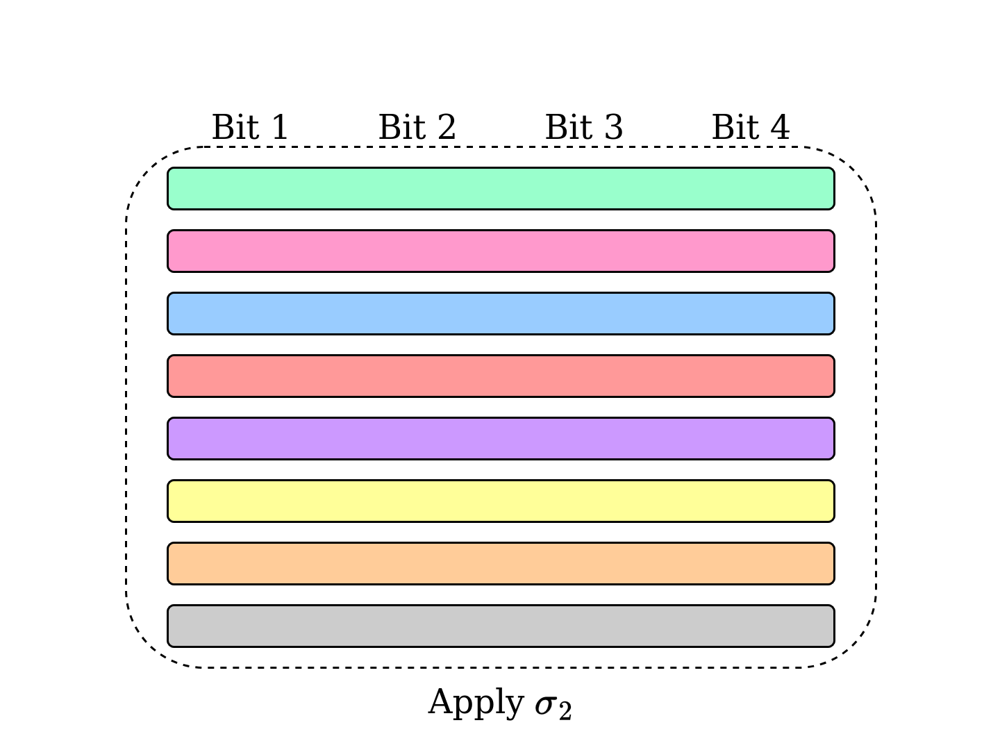
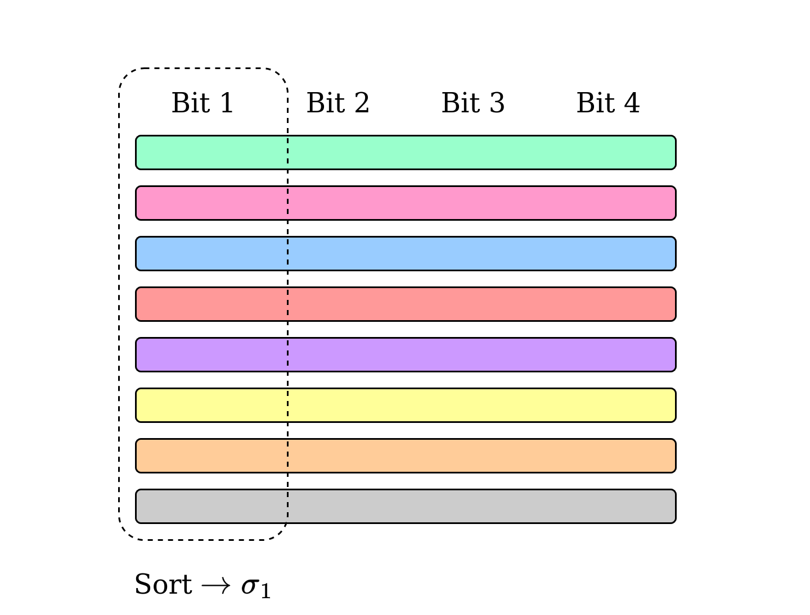
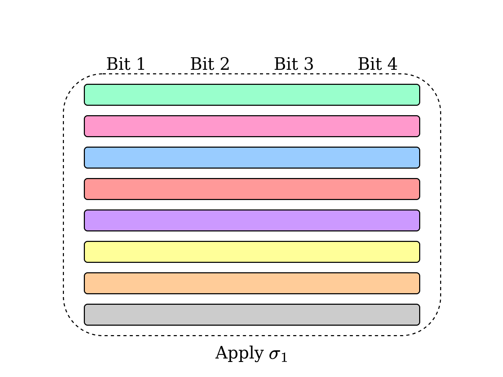
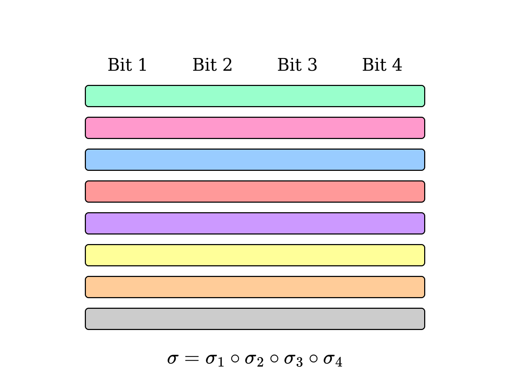

# Radix Sort

  

  = 1 && $slidev.nav.clicks <= 2">
  
  
  
  
  
  
  
  
  
  

  

  

  = 10">

<callout x="50" y="15" v-click="2">

  Single bit sorting is $O(n)$

</callout>

<SlideCurrentNo class="absolute bottom-8 right-10"/>