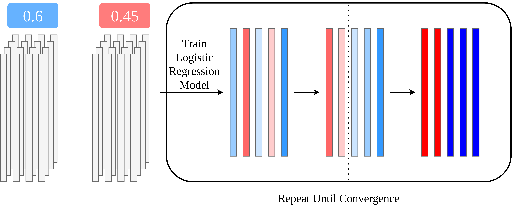

# Implementation in MPC

 

<ul>
  <li v-click="1">Initial label assignment can be performed in plaintext</li>
  <li v-click="2">Training a logistic regression model is supported by CrypTen</li>
  <li v-click="3">Computing thresholds requires oblivious sorting</li>
  <li v-click="4">Updated label assignment and convergence checking use secure comparisons</li>

   
   
   
   

  <li v-click="5">Training took 70 minutes</li>
  <li v-click="6">Code will be open source in the future</li>
</ul>

<!-- LLP Full Training Figure (bottom right) -->

  

<SlideCurrentNo class="absolute bottom-8 right-10"/>

<!--
To implement the algorithm under MPC, we combined out-of-the-box CrypTen tools with some custom algorithms.

The initial label assignment can be performed in plaintext, because it's based on public information.

Training a logistic regression model is supported by CrypTen without needing to make any modifications.

The key step in the algorithm is updating predictions by computing thresholds, and choosing the threshold requires oblivious sorting. We implemented Bitonic sort from the primitives exposed by CrypTen. This is the most expensive and most complex step in the algorithm.

Given the thresholds, updated predictions can be computed using a secure comparison. The last step of checking for convergence also reduces to secure comparison.

This entire algorithm is practially efficient. To give a sense for the time required, all computation ran in at most a few hours. Optimizing performance was not a priority, so if we were to scale the system up to, say, an order of magnitude more data, there are plenty of optimizations and fine tuning that we could implement to prevent performance from becoming an issue.

Finally, the code for the MPC implementation itself will be open source in the future.
-->