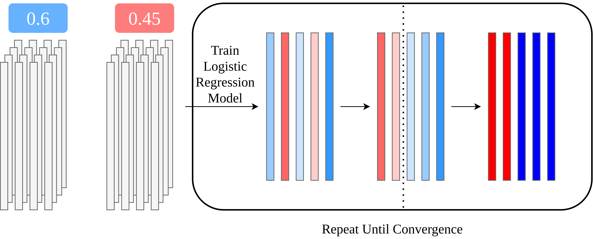

# The Plaintext Algorithm

 
 

  <!-- Left half of llp-full-training (appears on first click) -->
  
  
  <!-- Right half of llp-full-training (appears on second click) -->
  

<SlideCurrentNo class="absolute bottom-8 right-10"/>

<!--
We'll now talk about a plaintext algorithm for this problem, and then we'll see how to translate it to MPC.

As a reminder, the input to the model is a group of unlabeled histograms grouped together by state, where each state has a ground-truth label.

The learning algorithm follows a train update loop until it converges.

We repeat the following steps until we reach convergence.

We train a logistic regression model on the data.

Logistic regression requires each user to have a label, so we're going to assign each user a label. We start with some initial predictions which can either be random or based on their state's label. We're going to update these predictions in each iteration and retrain the logistic regression model.

After training a model for the iteration, we run inference with the model. Then, we sort each state's users by their prediction. We set a threshold for the output, and we update individual predictions by comparing them with the threshold.

So, after this step, if a state voted 60% Democratic in the election, we would assign a Democrat label to the 60% of users predicted to be most likely to vote Democratic.

We repeat this process until the predictions converge.
-->