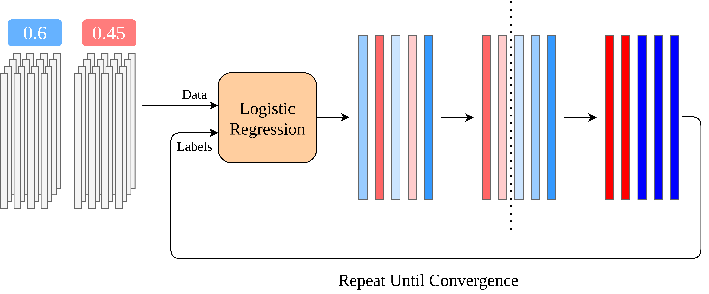

# The Plaintext Algorithm

 
 

  <!-- Left half of llp-full-training (appears on first click) -->
  
  
  <!-- Right half of llp-full-training (appears on second click) -->
  

<SlideCurrentNo class="absolute bottom-8 right-10"/>

<!--
To implement an LLP model under MPC, we first need to talk about the plaintext algorithm that it corresponds to.

As a reminder, the input to the model is a group of unlabeled histograms grouped together by state, where each state has a ground-truth label.

The learning algorithm follows a train update loop until it converges.

First we compute some initial predictions for each individual. This can either be random or based on their state's label.

Then, we repeat the following steps until we reach convergence.

We train a logistic regression model using the current predictions as the labels and run inference on the users given this model.

Then, we sort each state's users by their prediction. We set a threshold for the output so the aggregate prediction matches the ground truth, and we update individual predictions by comparing them with the threshold.

So, after this step, if a state voted 60% Democratic in the election, we would assign a Democrat label to the 60% of users predicted to be most likely to vote Democratic.

We repeat this process until the predictions converge.
-->