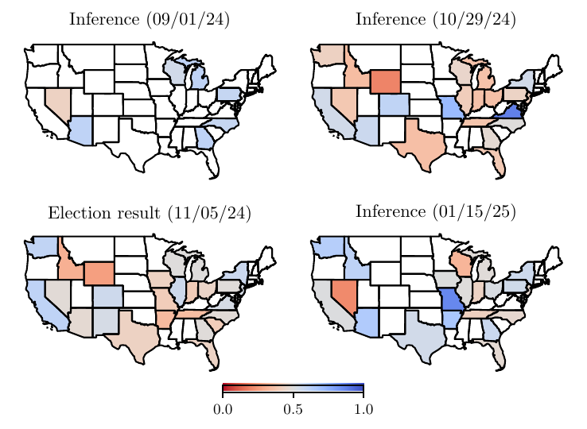

# Preliminary Results

  

    
  

<SlideCurrentNo class="absolute bottom-8 right-10"/>

<!--
While a detailed analysis from a political science perspective is outside the scope of this talk, I can give a glimpse of what the results look like.

A couple months before the election, our map is quite blue. Then, a week before the election, it's become pretty red, which lines up pretty well with the actual outcomes in the bottom left. After the election, we see a substantial swing back to the blue.
-->