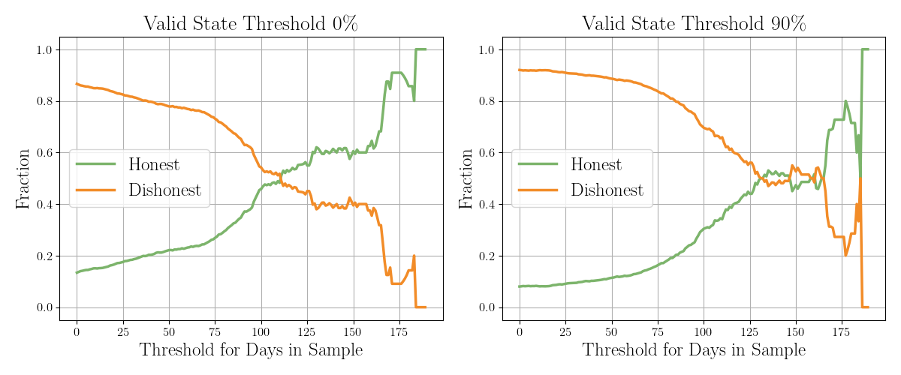
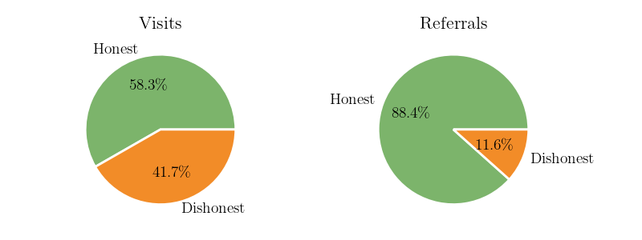

# Digging Deeper on the Data

  

     
    <ul>
      <li v-click="1">Users in the sample for longer are more honest
        <ul>
          <li class="nested-gray" v-click="2">Ephemeral dishonest users, consistent honest users</li>
        </ul>
      </li>
       
       
       
       
       
       
       
      <li v-click="4">Honest users contribute much richer data
        <ul>
          <li class="nested-gray" v-click="5">Referral data provides the best signal (Comarela et al.)</li>
        </ul>
      </li>
    </ul>
     
     
     
  

  

    
    
  

<SlideCurrentNo class="absolute bottom-8 right-10"/>

