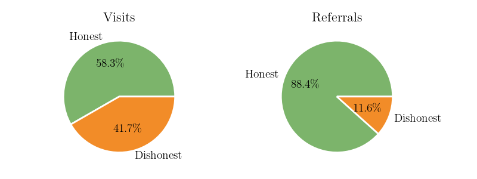

# Data Integrity Matters

  

    <ul>
       
      <li v-click="1">Trouble with dishonest reporting of location</li>
      <li v-click="2">Validation with IP addresses and geolocation</li>
      <li v-click="3">State-level results are concerning</li>
      <li v-click="4">Digging deeper on the data
        <ul>
          <li class="nested-gray" v-click="5">Users in the sample for longer are more honest</li>
          <li class="nested-gray" v-click="7">Honest users contribute much richer data</li>
        </ul>
      </li>
    </ul>
     
     
    
<strong>Lesson:</strong> Validating and enforcing user honesty should be a priority in future deployments.

     
    
<strong>Lesson:</strong> Our learning process is surprisingly robust to dishonest users.
  
  

  

    
    
  

<SlideCurrentNo class="absolute bottom-8 right-10"/>

