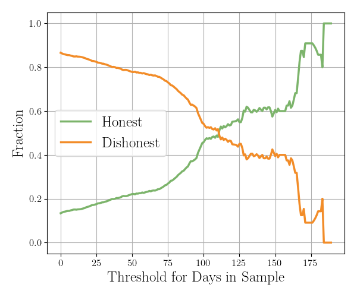

# Data Integrity Matters

  

    <ul>
       
      <li v-click="1">Initial trouble with dishonest location reporting</li>
      <li v-click="2">Validation with IP addresses and geolocation</li>
      <li v-click="3">Results were mixed
        <ul>
          <li class="nested-gray" v-click="4">Fully verified 15% of users</li>
        </ul>
      </li>
      <li v-click="5">Digging deeper on the data
        <ul>
          <li class="nested-gray" v-click="6">Users in the sample for longer are more honest</li>
          <li class="nested-gray" v-click="8">Honest users contribute much richer data</li>
        </ul>
      </li>
    </ul>
     
     
    
<strong>Lesson:</strong> Validating and enforcing user honesty should be a priority in future deployments.

     
    
<strong>Lesson:</strong> Our data is surprisingly robust to dishonest users.
  
  

  

    
    
  

<SlideCurrentNo class="absolute bottom-8 right-10"/>

<!--
The main lesson we learned was that data integrity matters.

Our initial advertisement targeted the swing states, which we realize gave users an incentive to report their state of residence dishonestly.

We sought to validate users' self-reported locations with IP addresses and geolocation, and we got mixed results.

While 98% of our users were in the United States, the state-level results are more concerning. We were only able to validate the honesty of 15% of users.

So, we dug deeper on the data, and we found 2 things. First, users who are in the sample for a longer period of time tend to be more honest. We had many ephemeral dishonest users and a smaller number of consistent honest users.

And second, honest users contribute much richer data. The 15% of users who were confirmed to be reporting honestly accounted for over half of the total visits and almost 90% of the total referrals.

From this, we learn 2 things. First, in future deployments, verifying user honesty and enforcing it where possible should be a priority.

And second, while we should seek to maximize the integrity of the data, the fact that honest users tend to contribute more valuable data means our learning process is surprisingly robust to dishonest users.
-->