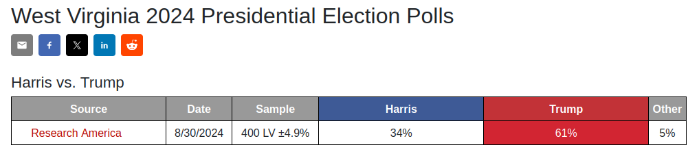

# Traditional Political Polling

  <!-- Left column: list & WV figure -->
  

    <ul>
      <li v-click="1">Data collection takes time
        <ul>
          <li class="nested-gray" v-click="2">High latency between poll commission and results</li>
        </ul>
      </li>
      <li v-click="3">Human‐intensive data collection
        <ul>
          <li class="nested-gray" v-click="4">Scaling to collect much more data would be costly</li>
        </ul>
      </li>
      <li v-click="5">Poor geographic and temporal coverage
        <ul>
          <li class="nested-gray" v-click="6">Results are concentrated in key regions immediately before an election</li>
          <li class="nested-gray" v-click="7">Many locations go unpolled, particularly early in an election cycle</li>
        </ul>
      </li>
    </ul>
    

      
    

  

  <!-- Right column: Michigan figure -->
  

    
  

<SlideCurrentNo class="absolute bottom-8 right-10"/>

<!--
As some more background, I'll outline some of the downsides of current approaches to political polling.

(on slide)

What I'm about to show is the list...

Just one. Now here's the same list...

Now, in the context of US presidential elections, this discrepancy makes sense
- pollster time is a scarce resource

but it does mean that we're leaving potentially valuable data and valuable insights on the table.
- if we were to have access to much more data, we might be able to learn a lot more
-->