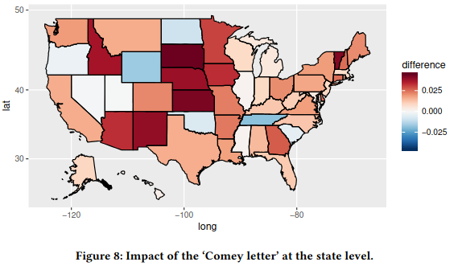

# Overview

<ul>
  <li v-click="1">We build a system for securely predicting political preferences</li>
  <li v-click="2">We collect and analyze data from almost 8000 unique users</li>
  <li v-click="3">All analysis takes place under MPC</li>
</ul>

 

<h3 v-click="4">Motivation</h3>

  

    <ul>
      <li v-click="5">Web browsing behavior can predict voting results</li>
      <li v-click="6">Quantifying the 'Comey Letter' (Comarela et al.)
        <ul>
          <li class="nested-gray" v-click="8">The event was too close to the election for other polling methods to detect the effect</li>
        </ul>
      </li>
    </ul>
  

  

    
  

<SlideCurrentNo class="absolute bottom-8 right-10"/>

