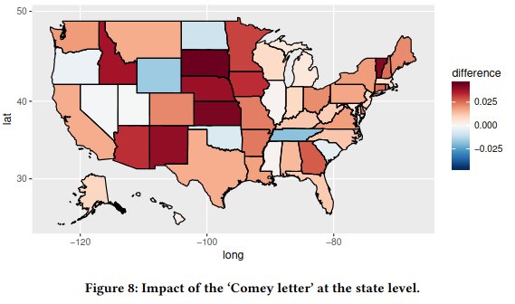

# Prior Work

  

     
    <ul>
      <li v-click="1">Web browsing behavior can predict voting results</li>
      <li v-click="2">Quantifying the 'Comey letter' (Comarela et al.)</li>
      <li v-click="4">Social media referrals are the best signal</li>
    </ul>
  

  

    
  

<SlideCurrentNo class="absolute bottom-8 right-10"/>

<!--
We're not the first to study this problem.

Prior work in both machine learning and political science has shown that web browsing behavior can predict political sentiment and voting results.

As an example that demonstrates all the best aspects of web browsing based polling, 

Comarela et al. use web browsing data to quantify the effect of the 2016 "Comey Letter" on a state-by-state basis.
- you can see their results on the right

Specifics of the letter are not important. What matters is that the event was too close to the election for other polling methods to detect the effect in time.

They also found that social media provide the best signal.

By this, I mean the number of times you arrived at a given website by clicking a link on social media.

The idea is that the website visits are a reflection of your social circle and your social media feed.
-->