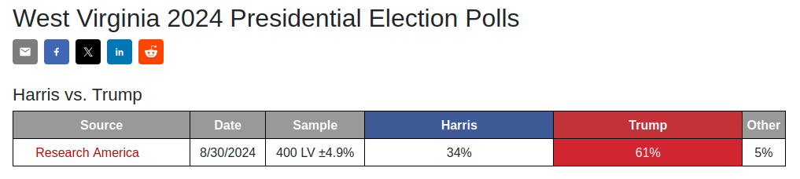
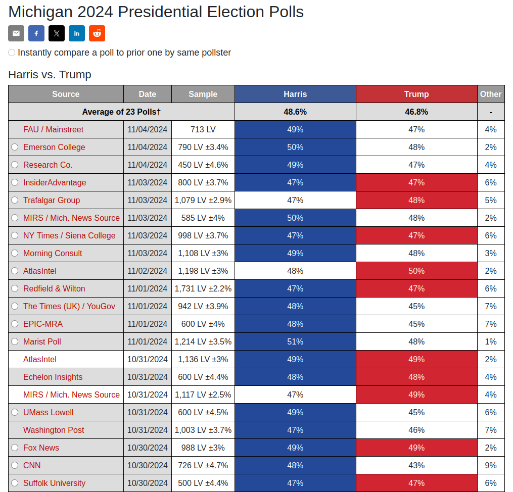

# Traditional Political Polling

  <!-- Left column: list & WV figure -->
  

     
    <ul>
      <li v-click="1">Data collection takes time</li>
      <li v-click="2">Data collection is human‐intensive</li>
      <li v-click="3">Poor geographic and temporal coverage</li>
    </ul>
     
    

      
    

  

  <!-- Right column: Michigan figure -->
  

    
  

<SlideCurrentNo class="absolute bottom-8 right-10"/>

<!--
This project is about a new way to do political polling.

I'll start by pointing out some of the downsides of traditional approaches to polling.

First, data collection takes time. There's typically a high latency between commissioning a poll and getting results.

Second, data collection is a human-intensive process, so scaling to collect more data is costly.

Finally, traditional polling offers poor geographic and temporal coverage. Polls are restricted to a few key areas immediately before an election, which means many locations go unpolled for weeks or months.

What I'm about to show is the complete list of polls commissioned in the state of WV in the last 3 months before the election.

Just one. Now here's the same list...

In the context of US presidential elections, this discrepancy makes sense.

But it does mean that we're leaving potentially valuable data and valuable insights on the table.

If we were to have access to much more data, we might be able to learn a lot more.
-->