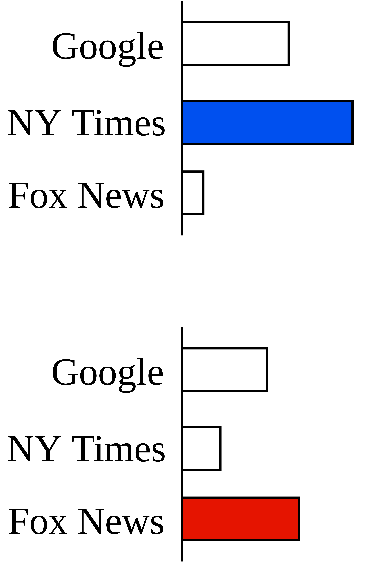

# Web Browsing for Political Polling

  

     
    <ul>
      <li v-click="1">Can website visits predict political leanings?</li>
      <li v-click="2">Example - news websites</li>
      <li v-click="4">More data</li>
      <li v-click="5">Fully automated</li>
    </ul>
  

  

    
  

<SlideCurrentNo class="absolute bottom-8 right-10"/>

<!--
With that in mind, we seek to conduct political polls based on web browsing data.

The starting point is the following question...

It's not hard to see why this might be the case. The media you consume can say a lot about your politics.

Take, for example, where you get your news. If you spend a lot of time on the New York Times website, that might be an indication that you lean more Democratic. If you frequent Fox News, that might indicate that you lean more Republican.

In addition to providing a good signal for political beliefs, monitoring web browsing allows us to collect a lot more data.

And, equally importantly, we can do so with a fully automated system.
-->