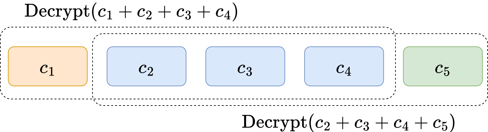

# Secure Aggregation

 

<v-clicks>

Many parties, very simple computations (sum).

</v-clicks>

<v-clicks depth="2">

- Ephemeral clients send encryptions to a powerful untrusted central server
- Design goal is non-interactivity
- Naive approach is threshold homomorphic encryption
    - Vulnerable to "residual attack"

</v-clicks>
<v-clicks>

The emerging paradigm uses a small committee to atomically decrypt (OPA, Willow, TACITA).

</v-clicks>

<SlideCurrentNo class="absolute bottom-8 right-10"/>

<!--
I want to start by talking about a line of work that has actually successfully scaled to thousands of parties by limiting itself to the simplest possible functions. This line of work is called secure aggregation.

In this line of work, we have many ephemeral clients that send encryptions of their inputs to a powerful and untrusted central server.

In these protocols, a key design goal is non-interactivity. By keeping everything non-interactive, they can scale to many clients without needing to coordinate the clients across many rounds.

A naive approach to the problem would be to use some kind of threshold homomorphic encryption scheme, where the server can decrypt only once it's received a sufficiently large volume of data. However, this approach is vulnerable to what's known as a residual attack. In a residual attack, the server runs threshold decryption on overlapping subsets of the inputs to reveal information about individual participants' inputss.

To get around this problem, there's an emerging paradigm over the past year or two which uses a small randomly selected committee which performs a simple secure computation to atomically decrypt the outputs and prevent repeated decryption by the server. In a sense, we're outsourcing the decryption function to a reasonably large collection of our peers.

Three papers in this line of work are OPA, Willow, and TACITA. OPA and Willow were at Crypto 2025 a couple months ago, while TACITA is still a preprint.
-->