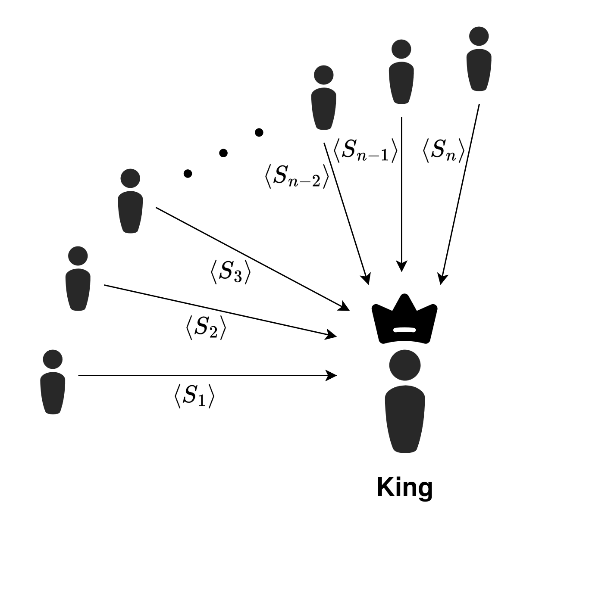
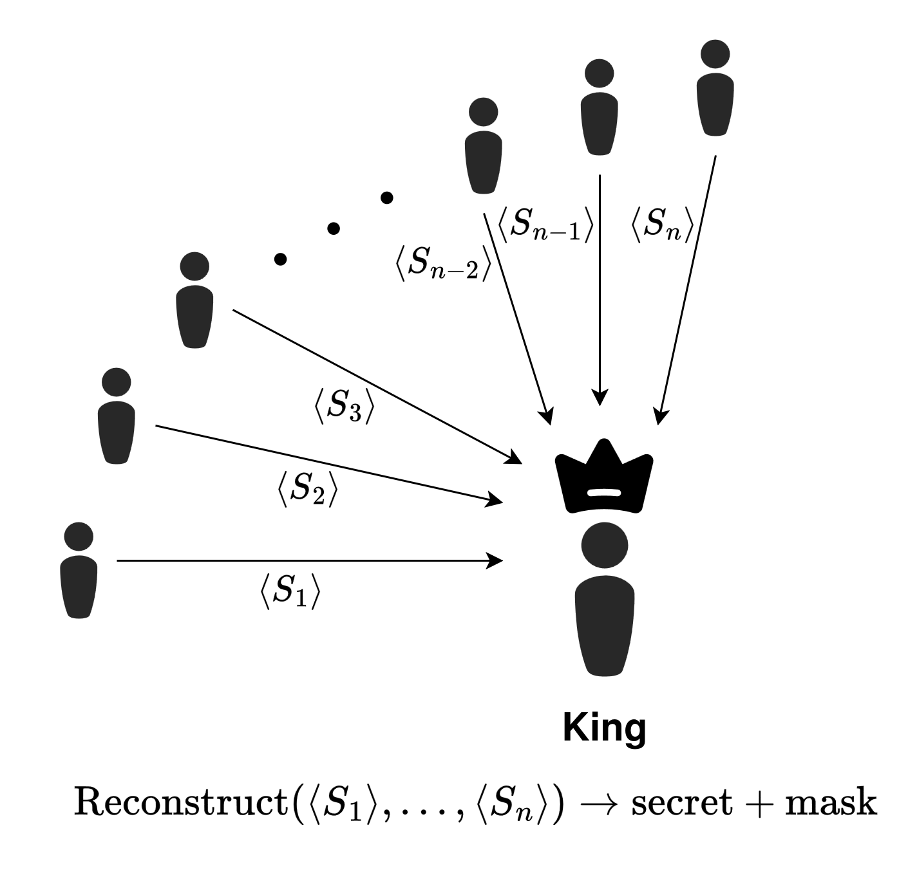
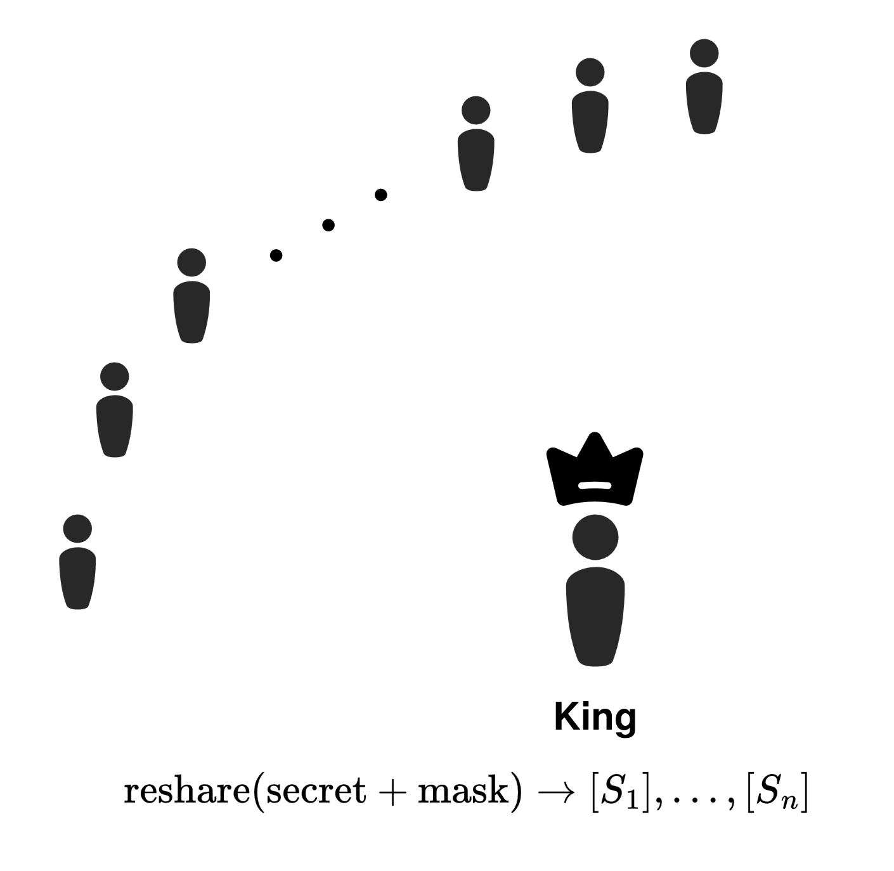
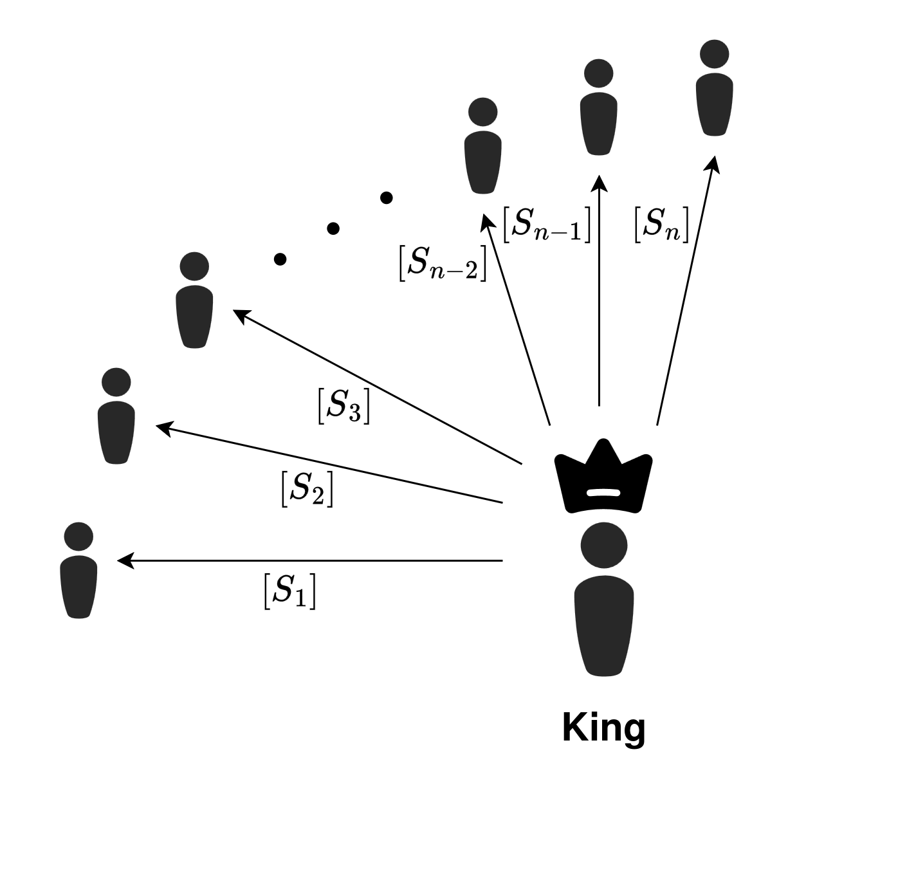

# DN07 Multiplication

 

<v-clicks>

- $[x]$ denotes a degree-$t$ Shamir sharing
- $\langle x \rangle$ denotes a degree-$2t$ Shamir sharing
- Local multiplication converts $t$ sharing to $2t$ sharing
- We need to perform a degree reduction
- Multiplication consumes a double sharing $([r], \langle r \rangle)$

</v-clicks>

  

  
  
  

  

  

<SlideCurrentNo class="absolute bottom-8 right-10"/>

<!--
To really understand how this protocol works, we need to understand the multiplication protocol.

We're using Shamir secret sharing, so we need to be specific about the threshold.

Let t be our reconstruction threshold. We'll use square brackets to denote a t-sharing, so any t shares can reconstruct the secret. And we'll use angled brackets to denote a 2t-sharing, so any 2t shares can reconstruct the secret.

We start and end the multiplication protocol in a t-sharing.

We can do a lot of the work in multiplication locally, but this transforms the t-sharing into a 2t-sharing, so we need to perform an interactive degree reduction step. The key idea of this family of protocols is the use of the star topology to achieve the degree reduction step.

It works as follows. First, note that all parties have a double sharing, which is a t-share and a 2t-share of the same random value.

All of the parties take their input to the degree reduction, which by now is a 2t-sharing, and mask it with the 2t-sharing of the random value. The king party can now reconstruct the masked secret, which reveals nothing to the king party about the secret itself.

Then, the king party creates a new t-sharing of the masked secret and redistributes it back to all the other parties.

At the end, the parties can unmask the received value using their t-sharing of the random value from the double sharing, so they have a t-sharing of the intended multiplication output.
-->