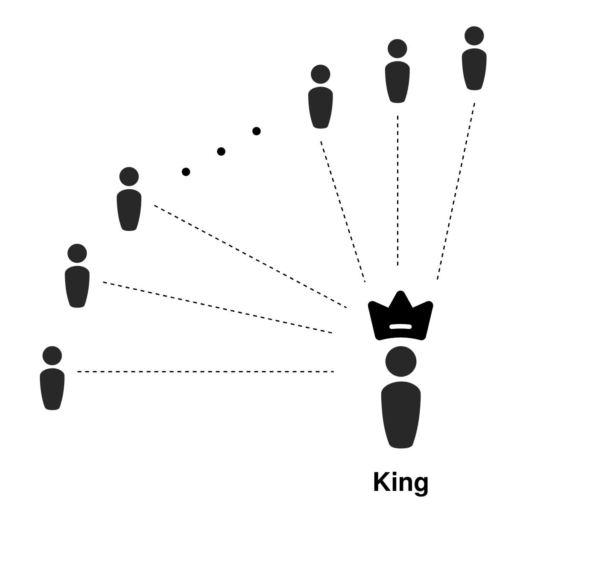
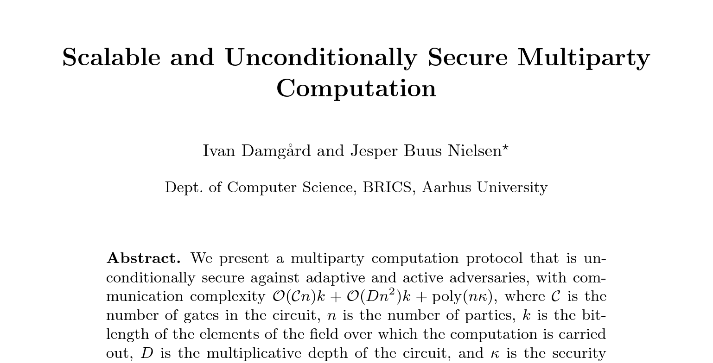

# A Star Topology

 

<v-clicks>

- Damgard-Nielsen, 2007
- Central untrusted "king" party
- $O(n)$ communication per gate
- Based on Shamir secret sharing
- Requires an honest majority

</v-clicks>

  

<SlideCurrentNo class="absolute bottom-8 right-10"/>

<!--
There's one particular family of protocols that I think is incredibly important in this direction. The starting point in this line of work is a paper by Damgard and Nielsen from 2007.

There's some more recent work in this family that I'll come to shortly, but I want to start by describing the foundation for this family of protocols.

The core design choice of the protocol is that everything revolves around a central king party. The king party is untrusted and doesn't hold any priveleged position in the computation, except for being the party with which all other parties communicate.

This allows us to run a computation with lots of parties while only maintaining a total number of connections that's linear in the number of parties, rather than quadratic, as it would be with an all-to-all communication pattern.

The communication pattern is simple, and this lets us achieve linear total communication per gate with practical efficiency up to a reasonable number of parties, far more than the 2 or 3 party setups we discussed earlier.

The protocol family is based on Shamir secret sharing, where we encode a secret as the y-intercept of a polynomial, and secret shares are points on the polynomial. Additionally, the protocol requires an honest majority assumption.

If you were to run this protocol with 3 parties, the threat model is hardly any different from the outsourced setting. However, it allows us to scale to many more parties, meaning we can distribute the honest majority assumption much more broadly.
-->