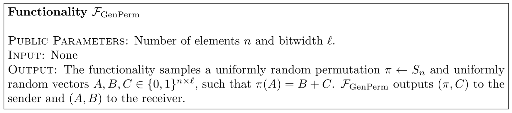

# Formally Defining the Problem

 

<v-clicks>

Three parameters we care about:

</v-clicks>

<v-clicks>

- $n$, the number of elements in a permutation correlation
- $\ell$, the bitwidth of each element of $A$, $B$, and $C$ in a single permutation correlation
- $p$, the total number of permutation correlations generated

</v-clicks>

<SlideCurrentNo class="absolute bottom-8 right-10"/>