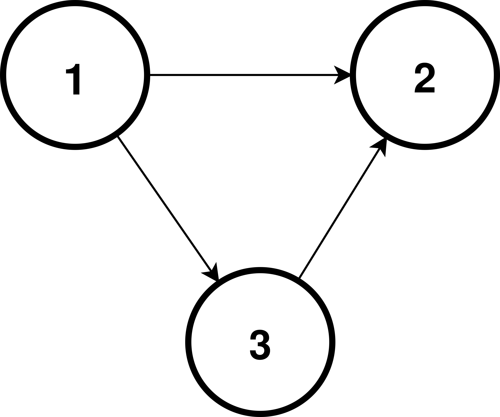
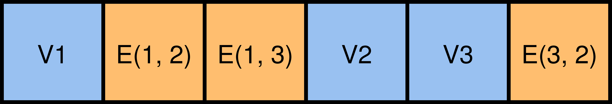
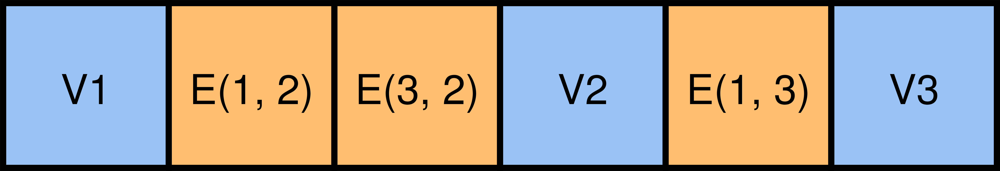

# Example: Graph Algorithms

 

<v-clicks>

Not easy to efficiently express a graph obliviously.

</v-clicks>

<v-clicks>

- Lots of data-dependent operations

</v-clicks>

 

<v-clicks>

The GraphSC paradigm (Nayak et al.)

</v-clicks>

<v-clicks>

- Encode the graph as a single list
- The list has two orderings
- Two important operations, scatter and gather
- Each operation is efficient only in one of the orderings
- Shuffling allows us to convert between the orderings

</v-clicks>

  

    
     
    
     
    
  

<SlideCurrentNo class="absolute bottom-8 right-10"/>

<!--
Another example where shuffle can be really helpful is for oblivious graph algorithms.

It's not easy to express a graph and operate over it obliviously. The typical graph algorithms that you're probably familiar with all require you to know which vertex you're operating on, as well as its set of edges. Of course, we could always express the graph as a matrix, but for real world graphs which aren't fully connected, this is going to be far too slow because of the quadratic blowup in time and space.

The standard way of dealing with graphs obliviously is through the GraphSC paradigm.

The core idea is to encode the graph as a single list containing all the vertices and edges as elements in the list.

And the list has two orderings: a source ordering, where vertices appear before their outgoing edges, and a destination ordering, where vertices appear after their incoming edges.

The GraphSC paradigm requires us to support only two operations, scatter and gather.

Each operation is efficient in only one of the orderings. Scatter is efficient in the source ordering but not the destination ordering, and gather is efficient in the destination ordering but not the source ordering.

What we want is the ability to swap between these two orderings without revealing the structure of the graph, and oblivious shuffling gives us this ability.
-->