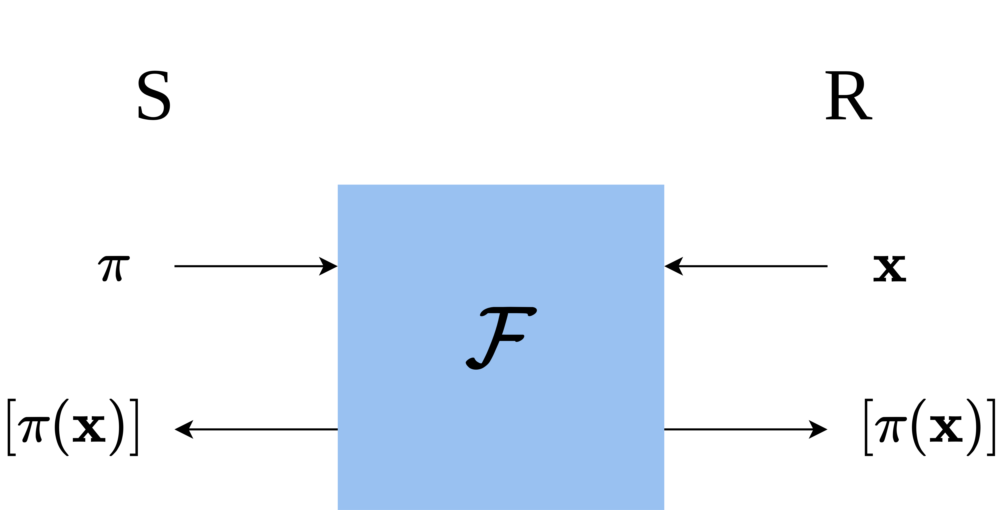

# Break the Problem in Half

 

<v-clicks depth="2">

- Let $\pi = \pi_1 \circ \pi_0$ be a composition of random permutations
    - $P_0$ knows $\pi_0$
    - $P_1$ knows $\pi_1$
    - Neither party knows anything about $\pi$
- One party acts as a sender, the other as a receiver

</v-clicks>
<v-clicks>

  

- Known as "Permute+Share"

</v-clicks>
