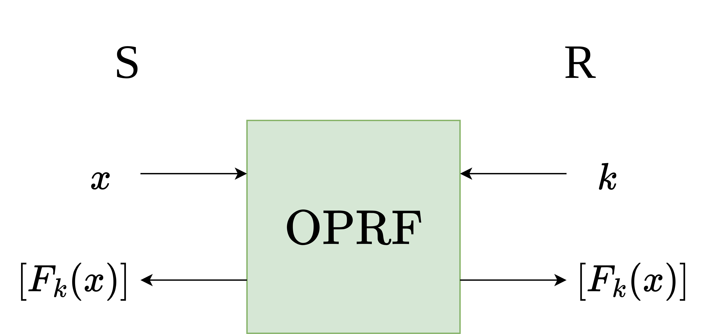

# Oblivious Pseudorandom Functions (OPRFs)

 

<v-clicks>

A core building block of each construction is an OPRF with secret-shared output.

</v-clicks>

<v-clicks>

- Sender provides an input $x$
- Receiver provides a key $k$
- Instantiated with the alternating-moduli family of PRFs
- Outputs a secret sharing

</v-clicks>

<SlideCurrentNo class="absolute bottom-8 right-10"/>

<!--
I mentioned that both constructions use oblivious pseudorandom functions as their core building block. Now we'll look at what these are.

We're particularly interested in OPRFs with secret-shared output, meaning the output is a secret sharing of the PRF evaluation, as opposed to one party getting the output in plaintext, which is the more common setting for OPRFs.

The input and output of this type of OPRF is shown in the figure in the corner.

The sender provides an input x. And the receiver provides a randomly sampled key k to the underlying PRF.

The underlying PRF is instantiated with the alternating-moduli family of PRFs, which is a family that has been custom-designed to be efficient under MPC.

As output, both parties receive a secret sharing of the PRF evaluated on the specified input and key.
-->