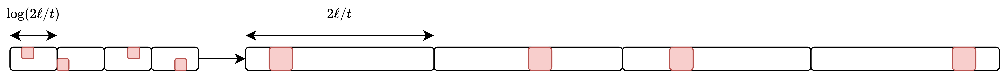

# Sublinear Protocol

 

<v-clicks>

Treat the output of the primary construction as a vector of seeds to pseudorandom correlation generators.

</v-clicks>

 

<v-clicks depth="2">

- Let $t$ be some sparsity parameter
- Each $\log(2\ell / t)$ bits encodes a unit vector of length $2 \ell / t$
- Compute each unit vector using a distributed point function (DPF)
- Concatenate $t$ unit vectors to obtain a $t$-sparse vector of length $2 \ell$
- Compress into a pseudorandom vector of length $\ell$
    - Reduction to syndrome decoding assumption

</v-clicks>
<v-clicks>

</v-clicks>
<SlideCurrentNo class="absolute bottom-8 right-10"/>

<!--
There's also a really interest extension to the first construction which is able to expand each element with sublinear communication.

The idea is that we run the first construction to get a permutation correlation with fairly short elements (say 500 bits each), and then we treat the elements in the correlation as seeds to pseudorandom correlation generators.

Pseudorandom correlation generators are a fairly recent primitive which allow the generation of correlation randomness with sublinear communication. The goal is typically to shift more of the burden of a protocol from communication to computation.

I'll show how we do the sublinear expansion. First, let t be some sparsity parameter. As an example, if our sparsity parameter is 8, then we're going to be working with vectors that have length 8 and Hamming weight 1.

We take our input and chop it up into a bunch of short pieces, where each piece has length log(2 ell over t) for a final output length of ell.

Each log(2 ell over t) bits of uniform randomness encode a unit vector of length 2 ell over t. So we're turning short dense randomness into long one-hot vectors, where the position of the hot element is defined by the short dense string.

We only have secret sharings of the short dense randomness, so we need to compute secret sharings of the sparse vectors. We can do this with distributed point functions. A distributed point function is an optimized construction that computes exactly this function. This function comes up a lot in this line of work on pseudorandom correlation generators, so these constructions have gotten quite fast.

At the end, we want to take our t independent unit vectors and concatenate them together to get a vector of total length 2 ell, with sparsity exactly t. This is where that sparsity parameter comes back in.

Then, we want to take the long sparse vector and compress it to half the length to obtain a shorter pseudorandom vector. The pseudorandomness property holds under cryptographic assumptions, specifically by a reduction to the syndrome decoding assumption.

So to sum up, we take a random string and expand it to an exponential length sparse string, then we compress that by half to get a still exponential length random string. That's how we can exponentially expand the randomness of each individual element in the correlation with sublinear communication.
-->