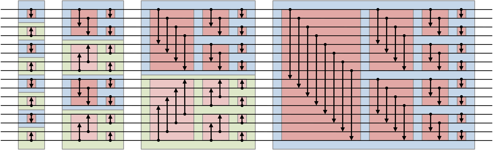

# Example: Oblivious Sorting

 

<v-clicks>

Oblivious sorting networks require $O(n \log^2 n)$ comparison gates.

</v-clicks>

<v-clicks>

- We want to match the plaintext $O(n \log n)$ algorithms

</v-clicks>
 
<v-clicks>

The shuffle-then-sort paradigm.

</v-clicks>
<v-clicks>

- Obliviously shuffle, then use a data-dependent sorting algorithm
- The revealed permutation is uncorrelated with the input
- Achieves $O(n \log n)$ secure comparisons

</v-clicks>

  

<SlideCurrentNo class="absolute bottom-8 right-10"/>

<!--
Before getting into the weeds of how we do this, I think it's important to see a couple of examples of why we even want to do this in the first place.

The first example is oblivious sorting.

There are circuits for oblivious sorting, typically called sorting networks, and these translate very naturally to the MPC setting, but they require O(n log^2 n) comparison gates (or have horrible constant factors).

Ideally, we'd be able to match the plaintext algorithms which require only O(n log n) comparisons. We're already going to be sacrificing performance by executing the computation securely, so we can't afford to make it worse with a suboptimal algorithm.

The solution to this is the shuffle-then-sort paradigm.

The idea is that we first obliviously shuffle the input vector, and then we're free to use a data-dependent sorting algorithm, like quicksort.

The data-dependent algorithm fully reveals the sorting permutation, but the shuffle ensures that the revealed permutation is uncorrelated with the input.

As a result, we're able to achieve a sorting algorithm with only O(n log n) secure comparisons.
-->