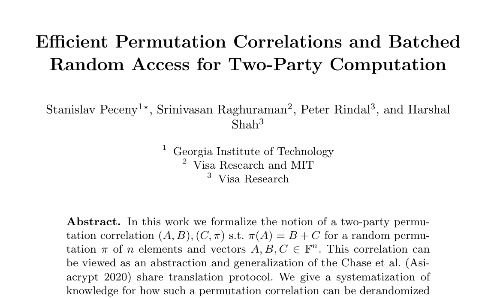

# State of the Art

 

<v-clicks>

Peceny, Raghuraman, Rindal, and Shah (PKC 2025)

</v-clicks>

<v-clicks>

- Two constructions
- Both based on oblivious pseudorandom functions

</v-clicks>

 
 

:::: div{class="sort-table absolute right-10 top-30 w-2/5" v-click="4"}

| Construction 1 | Construction 2 |
| --- | --- |
| $O(n \ell)$ | $O(n \log \ell)$ |

::::

  

<SlideCurrentNo class="absolute bottom-8 right-10"/>

<!--
Now I want to talk about what the state of the art constructions for permutation correlations look like. In particular, we'll be looking at two related constructions from a paper by Peceny, Raghuraman, Rindal, and Shah, from PKC 2025.

Both of their constructions fundamentally rely on oblivious pseudorandom functions. Each construction will make some number of calls to the OPRF for each element in the correlation, so both have linear complexity in n.

One of the constructions has linear communication in ell and is more practically efficient for most reasonable bitwidths.

The other construction has primarily been of theoretical interest so far, because it uses pseudorandom correlation generators to obtain sublinear communication in the bitwidth at the cost of significantly higher constant factors.
-->